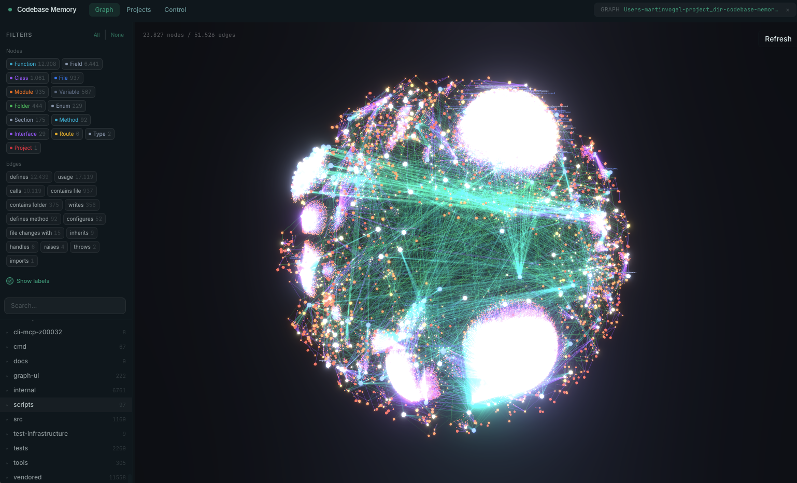

# codebase-memory-mcp

> **Fork notice:** This repository is maintained at
> [ycsx/codebase-memory-mcp](https://github.com/ycsx/codebase-memory-mcp) and contains
> additional Vue 2 / Webpack static-analysis support. It is based on the original
> [DeusData/codebase-memory-mcp](https://github.com/DeusData/codebase-memory-mcp) project.

[](https://github.com/ycsx/codebase-memory-mcp/releases)
[](LICENSE)
[](https://github.com/ycsx/codebase-memory-mcp/actions/workflows/dry-run.yml)
[](https://github.com/ycsx/codebase-memory-mcp)
[](https://github.com/ycsx/codebase-memory-mcp)
[](#hybrid-lsp)
[](https://github.com/ycsx/codebase-memory-mcp)
[](https://github.com/ycsx/codebase-memory-mcp)
[](INSTALL.md)
[](https://scorecard.dev/viewer/?uri=github.com/ycsx/codebase-memory-mcp)
[](https://slsa.dev)
[](SECURITY.md)
[](https://arxiv.org/abs/2603.27277)

**The fastest and most efficient code intelligence engine for AI coding agents.** Full-indexes an average repository in milliseconds, the Linux kernel (28M LOC, 75K files) in 3 minutes. Answers structural queries in under 1ms. Builds as a single static binary for macOS, Linux, and Windows.

High-quality parsing through [tree-sitter](https://tree-sitter.github.io/tree-sitter/) AST analysis across all 158 languages, enhanced with [**Hybrid LSP** semantic type resolution](#hybrid-lsp) for Python, TypeScript / JavaScript / JSX / TSX, PHP, C#, Go, C, C++, Java, Kotlin, Rust, and Perl — producing a persistent knowledge graph of functions, classes, call chains, HTTP routes, and cross-service links. 15 MCP tools. Zero dependencies. Plug and play across 43 supported automatic/conditional client surfaces.

> **Research** — The design and benchmarks behind this project are described in the preprint [*Codebase-Memory: Tree-Sitter-Based Knowledge Graphs for LLM Code Exploration via MCP*](https://arxiv.org/abs/2603.27277) (arXiv:2603.27277). Evaluated across 31 real-world repositories: 83% answer quality, 10× fewer tokens, 2.1× fewer tool calls vs. file-by-file exploration.

> **Security & Trust** — This tool reads your codebase and writes to your agent configuration files. That is what it is designed to do. If you prefer to audit before running, the [full source is here](https://github.com/ycsx/codebase-memory-mcp). The release workflow is configured to sign, checksum, and scan future fork binaries. All processing happens 100% locally; your code never leaves your machine. Found a security issue? See [SECURITY.md](SECURITY.md).

<p align="center">
  
  <br>
  <em>Built-in 3D graph visualization (UI variant) — explore your knowledge graph at localhost:9749</em>
</p>

## Why codebase-memory-mcp

- **Extreme indexing speed** — Linux kernel (28M LOC, 75K files) in 3 minutes. RAM-first pipeline: LZ4 compression, in-memory SQLite, fused Aho-Corasick pattern matching. Memory released after indexing.
- **Plug and play** — single static binary for macOS (arm64/amd64), Linux (arm64/amd64), and Windows (amd64). No Docker, no runtime dependencies, no API keys. Build → `install` → restart agent → done.
- **158 languages** — vendored tree-sitter grammars compiled into the binary. Nothing to install, nothing that breaks.
- **120x fewer tokens** — 5 structural queries: ~3,400 tokens vs ~412,000 via file-by-file search. One graph query replaces dozens of grep/read cycles.
- **43 supported automatic/conditional client surfaces** — `install` configures detected clients and safely activates conditional clients only when their documented platform, marker, or explicit existing config path is present. See [Multi-Agent Support](#multi-agent-support) for the complete matrix and manual/UI-only boundaries.
- **Built-in graph visualization** — 3D interactive UI at `localhost:9749` (optional UI binary variant).
- **Infrastructure-as-code indexing** — Dockerfiles, Kubernetes manifests, and Kustomize overlays indexed as graph nodes with cross-references. `Resource` nodes for K8s kinds, `Module` nodes for Kustomize overlays with `IMPORTS` edges to referenced resources.
- **15 MCP tools** — search, trace, architecture, impact analysis, targeted index-coverage checks, Cypher queries, dead code detection, cross-service HTTP linking, ADR management, and more.

## Quick Start

### Install from source (available now)

The fork does not currently publish GitHub Release assets, so source installation is
the working installation path. See [INSTALL.md](INSTALL.md) for prerequisites and
native Windows details.

**macOS / Linux** (standard binary):
```bash
curl -fsSL https://raw.githubusercontent.com/ycsx/codebase-memory-mcp/main/scripts/setup.sh | bash -s -- --from-source
```

With the embedded graph UI:
```bash
curl -fsSL https://raw.githubusercontent.com/ycsx/codebase-memory-mcp/main/scripts/setup.sh | bash -s -- --from-source --ui
```

**Windows native build** (run the build commands in an MSYS2 CLANG64 shell):
```bash
git clone https://github.com/ycsx/codebase-memory-mcp.git
cd codebase-memory-mcp
scripts/build.sh --with-ui CC=clang CXX=clang++
./build/c/codebase-memory-mcp.exe install -y
```

### Install from a GitHub Release

These commands become usable after this fork publishes a release containing the
matching `codebase-memory-mcp[-ui]-<os>-<arch>` assets and `checksums.txt`.

**macOS / Linux:**
```bash
curl -fsSL https://raw.githubusercontent.com/ycsx/codebase-memory-mcp/main/install.sh | bash
# Add --ui for the embedded graph UI:
curl -fsSL https://raw.githubusercontent.com/ycsx/codebase-memory-mcp/main/install.sh | bash -s -- --ui
```

**Windows:** download and run
`codebase-memory-mcp-ui-windows-<arch>-setup.exe` from the latest release. The
per-user installer needs no administrator rights, creates the visual-console
shortcut, and keeps indexes/settings when the application is uninstalled.

The PowerShell installer remains available for scripted and standard-binary
installations:

```powershell
# 1. Download the installer
Invoke-WebRequest -Uri https://raw.githubusercontent.com/ycsx/codebase-memory-mcp/main/install.ps1 -OutFile install.ps1

# 2. (Optional but recommended) Inspect the script
notepad install.ps1

# 3. Unblock the downloaded file (removes Mark-of-the-Web restriction added by browsers/Invoke-WebRequest)
Unblock-File .\install.ps1

# 4. Run it
.\install.ps1
```

> **Note:** If you see a script execution policy error, run `Set-ExecutionPolicy -Scope Process Bypass` first, or invoke with `PowerShell -ExecutionPolicy Bypass -File .\install.ps1`.

Options: `--ui` (graph visualization), `--skip-config` (binary only, no agent setup), `--dir=<path>` (custom location).

Restart your coding agent. Say **"Index this project"** — done.

<details>
<summary>Manual install</summary>

1. **Download** the archive for your platform from the [latest release](https://github.com/ycsx/codebase-memory-mcp/releases/latest):
   - `codebase-memory-mcp-<os>-<arch>.tar.gz` (macOS/Linux) or `.zip` (Windows) — standard
   - `codebase-memory-mcp-ui-<os>-<arch>.tar.gz` / `.zip` — with graph visualization

2. **Extract and install** (each archive includes `install.sh` or `install.ps1`):

   macOS / Linux:
   ```bash
   tar xzf codebase-memory-mcp-*.tar.gz
   ./install.sh
   ```

   Windows (PowerShell):
   ```powershell
   Expand-Archive codebase-memory-mcp-windows-amd64.zip -DestinationPath .
   Unblock-File .\install.ps1
   .\install.ps1
   ```

3. **Restart** your coding agent.

The `install` command automatically strips macOS quarantine attributes and ad-hoc signs the binary — no manual `xattr`/`codesign` needed.
</details>

The `install` command auto-detects installed coding agents and configures their documented MCP entries plus durable instructions, skills, and lifecycle hooks where supported.

### Graph Visualization UI

The UI is embedded by the `--with-ui` build. For the currently available source installation, add `--ui` to `scripts/setup.sh` or run `scripts/build.sh --with-ui`. Release archives and registry variants become available only after this fork publishes them.

Then run the foreground visual console:

```bash
codebase-memory-mcp console --port=9749
```

The command opens `http://127.0.0.1:9749` automatically and serves only on the
loopback interface. Add `--no-open` for CI or headless environments.

### Auto-Index

Enable automatic indexing on MCP session start:

```bash
codebase-memory-mcp config set auto_index true
```

When enabled, new projects are indexed automatically on first connection. Previously-indexed projects are registered with the background watcher for ongoing git-based change detection. Configurable file limit: `config set auto_index_limit 50000`.

Watcher registration is controlled separately by `auto_watch` (default `true`). Set `config set auto_watch false` to keep a session from registering its project with the background watcher — useful when working across many projects and you want each session contained to explicit indexing.

### Keeping Up to Date

For a source installation, pull the fork and rebuild. After the fork publishes a release, the built-in updater can be used:

```bash
codebase-memory-mcp update
```

The MCP server checks the ycsx repository for updates and notifies on the first tool call when a newer fork release exists.

### Uninstall

```bash
codebase-memory-mcp uninstall
```

Removes owned agent config entries, skills, hooks, instructions, and the installed binary. Existing graph indexes are listed and deleted only after confirmation.

## Features

### Graph & analysis
- **Architecture overview**: `get_architecture` returns languages, packages, entry points, routes, hotspots, boundaries, layers, and clusters in a single call
- **Architecture Decision Records**: `manage_adr` persists architectural decisions across sessions
- **Louvain community detection**: Discovers functional modules by clustering call edges
- **Git diff impact mapping**: `detect_changes` maps uncommitted changes to affected symbols with risk classification
- **Call graph**: Resolves function calls across files and packages (import-aware, type-inferred)
- **Dead code detection**: Finds functions with zero callers, excluding entry points
- **Cypher-like queries**: `MATCH (f:Function)-[:CALLS]->(g) WHERE f.name = 'main' RETURN g.name`

### Search
- **Semantic search** (`semantic_query`): vector search across the entire graph, powered by bundled Nomic `nomic-embed-code` embeddings (40K tokens, 768d int8) compiled into the binary — no API key, no Ollama, no Docker. 11-signal combined scoring (TF-IDF, RRI, API/Type/Decorator signatures, AST profiles, data flow, Halstead-lite, MinHash, module proximity, graph diffusion).
- **BM25 full-text search** via SQLite FTS5 with `cbm_camel_split` tokenizer (camelCase / snake_case aware)
- **Structural search** (`search_graph`): regex name patterns, label filters, min/max degree, file scoping
- **Code search** (`search_code`): graph-augmented grep over indexed files only

### Cross-service linking
- **HTTP** route ↔ call-site matching with confidence scoring
- **gRPC, GraphQL, tRPC** service detection with protobuf Route extraction
- **Channel detection** (`EMITS` / `LISTENS_ON`) for Socket.IO, EventEmitter, and generic pub-sub patterns across 8 languages with constant resolution

### Cross-repo intelligence
- **`CROSS_*` edges** link nodes across multiple repos indexed under the same store
- **Multi-galaxy 3D UI layout** for cross-repo architecture visualization
- **Cross-repo architecture summary** combining services, routes, and dependencies across the indexed fleet

### Edge types (selected)
- `CALLS`, `IMPORTS`, `DEFINES`, `IMPLEMENTS`, `INHERITS`
- `HTTP_CALLS`, `ASYNC_CALLS` (cross-service)
- `EMITS`, `LISTENS_ON` (channels)
- `DATA_FLOWS` with arg-to-param mapping + field access chains
- `SIMILAR_TO` (MinHash + LSH near-clone detection, Jaccard scored)
- `SEMANTICALLY_RELATED` (vocabulary-mismatch, same-language, score ≥ 0.80)

### Indexing pipeline
- **158 vendored tree-sitter grammars** compiled into the binary
- **Generic package / module resolution** — bare specifiers like `@myorg/pkg`, `github.com/foo/bar`, `use my_crate::foo` resolved via manifest scanning (`package.json`, `go.mod`, `Cargo.toml`, `pyproject.toml`, `composer.json`, `pubspec.yaml`, `pom.xml`, `build.gradle`, `mix.exs`, `*.gemspec`)
- **Infrastructure-as-code indexing** — Dockerfiles, Kubernetes manifests, Kustomize overlays as graph nodes
- **[Hybrid LSP semantic type resolution](#hybrid-lsp)** for Python, TypeScript / JavaScript / JSX / TSX, PHP, C#, Go, C, C++, Java, Kotlin, Rust, and Perl — a lightweight C implementation of language type-resolution algorithms, structurally inspired by and compatible with major language servers including tsserver / typescript-go, pyright, gopls, Roslyn, Eclipse JDT, and rust-analyzer (parameter binding, return-type inference, generic substitution, JSX component dispatch, JSDoc inference for plain JS files, namespace + trait + late-static-binding resolution for PHP, file-scoped namespaces + records + LINQ method syntax for C#, class-hierarchy + overload + lambda resolution for Java, extension-function + scope-function resolution for Kotlin, trait-method + UFCS resolution for Rust)
- **RAM-first pipeline**: LZ4 compression, in-memory SQLite, single dump at end. Memory released after.

### Distribution & operation
- **Single static binary, zero infrastructure**: SQLite-backed, persists to `~/.cache/codebase-memory-mcp/`
- **Auto-sync**: Background watcher detects file changes and re-indexes automatically
- **Route nodes**: REST endpoints are first-class graph entities
- **CLI mode**: `codebase-memory-mcp cli search_graph '{"project": "my-project", "name_pattern": ".*Handler.*"}'`
- **Distribution status**: source builds are available now; npm, PyPI, Homebrew, Scoop, Winget, Chocolatey, AUR, and `go install` metadata are release templates until separately published for this fork

## Team-Shared Graph Artifact

Commit a single compressed file to your repo and your teammates skip the reindex.

`.codebase-memory/graph.db.zst` is a zstd-compressed snapshot of the knowledge graph that lives next to your source. When you index, the artifact is written or refreshed; when a teammate clones the repo and runs `codebase-memory-mcp` for the first time, the artifact is decompressed and incremental indexing fills in their local diff.

- **Format**: SQLite database, indexes stripped, `VACUUM INTO` compacted, then zstd 1.5.7 compressed (8–13:1 ratio typical)
- **Two tiers**:
  - **Best** (`zstd -9` + index strip + `VACUUM INTO`) — written on explicit `index_repository`
  - **Fast** (`zstd -3`) — written by the watcher for low-latency incremental updates
- **Bootstrap**: when no local DB exists but the artifact is present, `index_repository` imports the artifact first, then runs incremental indexing — avoiding the full reindex cost
- **No merge pain**: a `.gitattributes` line with `merge=ours` is auto-created on first export, so concurrent edits don't produce conflicts on the binary artifact
- **Optional**: never committed unless you want it. Add `.codebase-memory/` to `.gitignore` if you prefer everyone to reindex from scratch.

The result is similar in spirit to graphify's `graphify-out/` directory, but as a single compressed file with explicit two-tier export, integrity-checked import, and zero merge friction.

## How It Works

codebase-memory-mcp is a **structural analysis backend** — it builds and queries the knowledge graph. It does **not** include an LLM. Instead, it relies on your MCP client (Claude Code, or any MCP-compatible agent) to be the intelligence layer.

```
You: "what calls ProcessOrder?"

Agent calls: trace_path(function_name="ProcessOrder", direction="inbound")

codebase-memory-mcp: executes graph query, returns structured results

Agent: presents the call chain in plain English
```

**Why no built-in LLM?** Other code graph tools embed an LLM for natural language → graph query translation. This means extra API keys, extra cost, and another model to configure. With MCP, the agent you're already talking to *is* the query translator.

## Performance

Benchmarked on Apple M3 Pro:

| Operation | Time | Notes |
|-----------|------|-------|
| **Linux kernel full index** | **3 min** | 28M LOC, 75K files → 4.81M nodes, 7.72M edges |
| Linux kernel fast index | 1m 12s | 1.88M nodes |
| Django full index | ~6s | 49K nodes, 196K edges |
| Cypher query | <1ms | Relationship traversal |
| Name search (regex) | <10ms | SQL LIKE pre-filtering |
| Dead code detection | ~150ms | Full graph scan with degree filtering |
| Trace call path (depth=5) | <10ms | BFS traversal |

**RAM-first pipeline**: All indexing runs in memory (LZ4 HC compressed read, in-memory SQLite, single dump at end). Memory is released back to the OS after indexing completes.

**Token efficiency**: Five structural queries consumed ~3,400 tokens via codebase-memory-mcp versus ~412,000 tokens via file-by-file grep exploration — a **99.2% reduction**.

## Troubleshooting & Diagnostics

codebase-memory-mcp runs **100% locally and collects no telemetry** — your code, queries, environment, and usage never leave your machine. That privacy guarantee also means that when you hit something we can't reproduce on our side (a slow memory climb over hours, a performance regression, a leak that only appears after days of real use), **we have no data at all unless you choose to send it.** Here is how to capture it yourself.

### Capture a diagnostics log

Set `CBM_DIAGNOSTICS=1` before the MCP server starts, then reproduce the problem (let it run as long as it takes — a slow leak needs time to show in the trend). The server writes two files to your system temp directory (`$TMPDIR` or `/tmp` on macOS/Linux, `%TEMP%` on Windows):

| File | What it is |
|------|------------|
| `cbm-diagnostics-<pid>.ndjson` | **The memory trajectory** — one JSON line every 5 s with `rss`, `committed` (Windows commit charge), `peak_*`, `page_faults`, `fd`, and `queries`. **This is the file we need for memory/leak reports** — the *trend over time* is what pinpoints a leak. It is **kept on disk after the server exits** (so you can grab it post-mortem) and rotates to `.ndjson.1` past ~8 MB. |
| `cbm-diagnostics-<pid>.json` | The latest snapshot only — handy for a quick live check. Removed on clean exit. |

The startup log prints both paths, e.g.:

```
level=info msg=diagnostics.start snapshot=/tmp/cbm-diagnostics-12345.json trajectory=/tmp/cbm-diagnostics-12345.ndjson interval=5s
```

Set the variable in the `env` block of your agent's MCP server config, or export it before launching the server.

### What to share

When you open a memory/performance issue, **attach the `.ndjson` trajectory** — it contains no source code or query text, only resource counters. If you'd rather not attach a file, paste it (or an agent's summary of it) into the issue: your assistant can read the NDJSON directly and report whether `rss`/`committed` grow monotonically, how fast, and relative to query count — which is exactly what we need to find the cause.

## Installation

### Planned Pre-built Binaries

The following artifact names are produced by the release workflow, but this fork has not published them yet:

| Platform | Standard | With Graph UI |
|----------|----------|---------------|
| macOS (Apple Silicon) | `codebase-memory-mcp-darwin-arm64.tar.gz` | `codebase-memory-mcp-ui-darwin-arm64.tar.gz` |
| macOS (Intel) | `codebase-memory-mcp-darwin-amd64.tar.gz` | `codebase-memory-mcp-ui-darwin-amd64.tar.gz` |
| Linux (x86_64) | `codebase-memory-mcp-linux-amd64.tar.gz` | `codebase-memory-mcp-ui-linux-amd64.tar.gz` |
| Linux (ARM64) | `codebase-memory-mcp-linux-arm64.tar.gz` | `codebase-memory-mcp-ui-linux-arm64.tar.gz` |
| Windows (x86_64) | `codebase-memory-mcp-windows-amd64.zip` | `codebase-memory-mcp-ui-windows-amd64.zip` |

A future release must include `checksums.txt` with SHA-256 hashes. The binaries are built to be statically linked with no shared library dependencies.

> **Windows note**: SmartScreen may show a warning for unsigned software. Click **"More info"** → **"Run anyway"**. Verify integrity with `checksums.txt`.

### Setup Scripts

<details>
<summary>Automated source build + install</summary>

**macOS / Linux:**

```bash
curl -fsSL https://raw.githubusercontent.com/ycsx/codebase-memory-mcp/main/scripts/setup.sh | bash -s -- --from-source
```

**Windows (PowerShell):**

```powershell
Invoke-WebRequest https://raw.githubusercontent.com/ycsx/codebase-memory-mcp/main/scripts/setup-windows.ps1 -OutFile setup-windows.ps1
./setup-windows.ps1 -FromSource
```

</details>

### Package Registries

The manifests under `pkg/` are maintained as release templates. Installing the existing public package with the same name may install the upstream project, not this fork. Use the source instructions above until ycsx publishes fork-owned packages.

### Install via Claude Code

```
You: "Install this MCP server: https://github.com/ycsx/codebase-memory-mcp"
```

### Build from Source

<details>
<summary>Prerequisites: C compiler + zlib</summary>

| Requirement | Check | Install |
|-------------|-------|---------|
| **C compiler** (gcc or clang) | `gcc --version` or `clang --version` | macOS: `xcode-select --install`, Linux: `apt install build-essential` |
| **C++ compiler** | `g++ --version` or `clang++ --version` | Same as above |
| **zlib** | — | macOS: included, Linux: `apt install zlib1g-dev` |
| **Git** | `git --version` | Pre-installed on most systems |

</details>

```bash
git clone https://github.com/ycsx/codebase-memory-mcp.git
cd codebase-memory-mcp
scripts/build.sh                    # standard binary
scripts/build.sh --with-ui          # with graph visualization
# Binary at: build/c/codebase-memory-mcp
```

### Manual MCP Configuration

<details>
<summary>If you prefer not to use the install command</summary>

Add to `~/.claude.json` (user scope) or project `.mcp.json`:

```json
{
  "mcpServers": {
    "codebase-memory-mcp": {
      "command": "/path/to/codebase-memory-mcp",
      "args": []
    }
  }
}
```

Restart your agent. Verify with `/mcp` — you should see `codebase-memory-mcp` with 15 tools.

</details>

### Remote MCP for Codex

The standard binary can also serve authenticated MCP Streamable HTTP without
the embedded UI:

```bash
codebase-memory-mcp serve --bind=0.0.0.0 --port=9766
```

`CBM_MCP_AUTH_TOKEN` and `CBM_MCP_AUDIT_LOG` are required. Remote mode defaults
to the restricted `analysis` tool profile and records each request by effective
client IP. See [Remote MCP deployment](docs/REMOTE_MCP.md) for `.env`, TLS,
trusted-proxy, systemd, Nginx, and Codex configuration.

## Multi-Agent Support

`install` configures 43 client surfaces: 37 detected automatically and 6
conditional or explicit. “Conditional” means the installer writes only when the
documented platform or an explicit, already-existing config path proves the
target is active. It never flips experimental feature flags, enables plugins,
YOLO modes, global permission bypasses, or third-party instruction trust.

Where a client has a documented custom-agent format, the installer creates three
exact-owned definitions from one canonical contract:

- **Scout (Tier 1)** — about 3–4 narrow calls for fast positive, provisional discovery; no absence, exhaustive-impact, or dead-code claims.
- **Verify (Tier 2, default)** — task-directed graph evidence, exact source checks, path coverage for every cited file, and scope coverage before negative claims.
- **Auditor (Tier 3)** — bounded scope, current index generation, complete relevant pagination, broader relationship checks, and explicit unresolved limitations.

Every direct tier batches `check_index_coverage` for its evidence paths and reads
flagged ranges or skipped/excluded files directly. A clean coverage result means
only “no recorded gap,” never proof of completeness. Clients without safe child
MCP access receive the same three tiers as parent-handoff agents; the parent must
supply project, generation, pagination state, graph evidence, and coverage
results. Updates migrate only byte-identical prior Verify definitions and never
overwrite user-modified agents.

| Agent | Activation | MCP config | Durable context / augmentation |
|-------|------------|------------|--------------------------------|
| Claude Code | Detected | `~/.claude.json` | Skill + three exact-tool graph agents; `SessionStart`, `SubagentStart`, non-blocking `PreToolUse` for `Grep`/`Glob`, and post-`Read` coverage |
| Codex CLI | Detected | `$CODEX_HOME/config.toml` | `AGENTS.md`, skill, three read-only agents; `SessionStart` + `SubagentStart` |
| Gemini CLI | Detected | `.gemini/settings.json` | `GEMINI.md`, three explicit read/graph-tool subagents; `BeforeTool`, `AfterTool` `read_file` coverage, and `SessionStart` |
| Zed | Detected | platform `settings.json` (JSONC) | `AGENTS.md` + shared skill |
| OpenCode | Detected | `$OPENCODE_CONFIG` or resolved global config | `AGENTS.md`, skill, three deny-by-default read-only agents |
| Antigravity | Detected | `.gemini/config/mcp_config.json` | `.gemini/GEMINI.md` |
| Aider | Detected | — | `CONVENTIONS.md` via `.aider.conf.yml` |
| KiloCode | Detected | `.config/kilo/kilo.jsonc` | Rule + three graph-tool subagents with deny-by-default permissions |
| VS Code | Detected | platform `Code/User/mcp.json` | `~/.copilot/skills`, three read-only agents, `sessionStart` + `subagentStart` |
| Cursor | Detected | `.cursor/mcp.json` | Skill + three read-only parent-handoff agents; context hooks withheld because session injection races and `readonly` blocks MCP |
| Windsurf | Detected | `~/.codeium/windsurf/mcp_config.json` | Always-on `global_rules.md` |
| Augment / Auggie | Detected | `~/.augment/settings.json` | Rule, three read-only handoff subagents, `SessionStart` + post-`view` coverage |
| OpenClaw | Detected | `$OPENCLAW_CONFIG_PATH` or state `openclaw.json` | Active-workspace `AGENTS.md` + `TOOLS.md`; compaction reinjection |
| Kiro | Detected | `$KIRO_HOME/settings/mcp.json` | Steering, skill, three JSON agents with isolated Scout/Analysis-profile MCP and explicit graph-tool selectors (`includeMcpJson: false`) |
| Junie | Detected | `.junie/mcp/mcp.json` | Skill + three graph subagents for EAP-capable builds; Scout and Analysis server aliases hard-limit the tier tool surfaces; no ineffective EAP `SessionStart` hook |
| Hermes | Detected | `$HERMES_HOME/config.yaml` | Skill + fail-open `pre_llm_call` context augmentation |
| OpenHands | Detected | `.openhands/mcp.json` | Shared `.agents/skills/codebase-memory/SKILL.md` |
| Cline | Detected | `~/.cline/mcp.json` + `${CLINE_DATA_DIR:-~/.cline/data}/settings/cline_mcp_settings.json` | Rule + skill; automatic file hooks withheld because they auto-activate and their output is not reliably consumed; child agents cannot use MCP |
| Warp | Detected, skill only | UI, Warp Drive, or per invocation (manual) | Shared `~/.agents/skills/codebase-memory/SKILL.md` |
| Qwen Code | Detected | `.qwen/settings.json` | `QWEN.md`, skill, three explicit read/graph-tool agents; `SessionStart`, `SubagentStart`, and post-`ReadFile` coverage |
| GitHub Copilot CLI | Detected | `$COPILOT_HOME/mcp-config.json` | Instructions, skill, three read-only agents; `sessionStart` + `subagentStart` |
| Factory Droid | Detected | `.factory/mcp.json` | `AGENTS.md`, skill, three droids with exact per-tier graph-tool lists (without additive whole-server exposure); `SessionStart` + post-`Read` coverage on macOS/Linux, withheld on Windows |
| Crush | Detected | `.config/crush/crush.json` | Managed context path with explicit parent-to-child handoff |
| Goose | Detected | `.config/goose/config.yaml` | `.goosehints` |
| Mistral Vibe | Detected | `$VIBE_HOME/config.toml` | `AGENTS.md`, skill, and three matched agent/prompt pairs with explicit read-only graph-tool allowlists |
| Qoder CLI | Detected | `~/.qoder/settings.json` | Skill, three directly MCP-attached agents with named-server scoping and exact per-tier graph-tool lists; `SessionStart`, `SubagentStart`, and post-`Read` coverage, including documented PowerShell execution on Windows |
| Kimi Code CLI | Detected | `$KIMI_CODE_HOME/mcp.json` (default `~/.kimi-code`) | Same-root `AGENTS.md` + skill; fail-open `UserPromptSubmit` hook in `config.toml` |
| GitLab Duo CLI | Detected | `$GLAB_CONFIG_DIR/duo/mcp.json` or platform fallback | Fail-open user `SessionStart` on macOS/Linux; hook withheld on Windows; no experimental global skill enablement |
| Rovo Dev CLI | Detected | configured override or `~/.rovodev/mcp.json` | Global `AGENTS.md`, skill + three read-only handoff subagents; no undocumented hook |
| Amp | Detected | `~/.config/agents/skills/codebase-memory/mcp.json` | Colocated skill + `~/.config/amp/AGENTS.md`; no plugin |
| Devin CLI / Local | Detected | `~/.config/devin/config.json` (platform app-data path on Windows) | Same-root `AGENTS.md` + skill; macOS/Linux `UserPromptSubmit` + `PostCompaction`, and `SessionStart` only when Claude does not already provide it; hooks withheld on Windows |
| Tabnine | Detected | `~/.tabnine/mcp_servers.json` | MCP only; no experimental/YOLO setting |
| Continue / cn | Conditional | Existing `~/.continue/config.yaml` or `$CBM_CONTINUE_CONFIG_PATH` | MCP only |
| Visual Studio | Conditional, Windows | `~/.mcp.json` | MCP only |
| TRAE | Conditional | Existing `$CBM_TRAE_CONFIG_PATH` | MCP only |
| Roo Code | Conditional | Existing `$CBM_ROO_CONFIG_PATH` | MCP only |
| Amazon Q Developer IDE | Detected | `~/.aws/amazonq/default.json` (preserves an existing `agents/default.json` or legacy `mcp.json`) | MCP only |
| CodeBuddy Code CLI | Detected | `~/.codebuddy/.mcp.json` (preserves an active deprecated/legacy file) | `CODEBUDDY.md`, skill, three read-only graph agents; beta hooks are not auto-installed |
| IBM Bob Shell | Detected by `bob` | `~/.bob/mcp_settings.json` | Shared rule; no invented hook or agent |
| Pochi | Detected | `~/.pochi/config.jsonc` (`mcp`) | `README.pochi.md`, skill, and three `readFile`-only parent-handoff agents |
| Pi | Detected | — | `~/.pi/agent/AGENTS.md` + skill; MCP/subagents require an explicit reviewed extension |
| IBM Bob IDE | Conditional | Existing `~/.bob/mcp.json` | Shared rule + IDE skill; no invented hook or agent |
| Sourcegraph Cody | Explicit opt-in | Existing `$CBM_CODY_CONFIG_PATH` | MCP only |

### Sessions, compaction, and subagents

Hooks installed by this project are fail-open and context-only. Claude Code's
`PreToolUse` observes `Grep`/`Glob` and injects matching graph symbols as
`additionalContext`; `PostToolUse` on `Read` adds targeted coverage context when
the graph could not fully parse or index that file. It never denies or replaces
the requested tool call.

Claude Code, Codex CLI, Qwen Code, GitHub Copilot CLI, and VS Code's Copilot
runtime receive paired session/subagent context where the vendor exposes a
documented context-output contract. Codex users must review and trust installed
hooks through `/hooks`; changing a hook definition changes its trust hash, so an
update can require re-trust. Qoder uses `SessionStart`, `SubagentStart`, and
post-`Read` coverage, including its documented PowerShell executor on Windows.
Kimi uses `UserPromptSubmit`, while Hermes uses `pre_llm_call`; both retain their
documented Windows execution paths. Devin installs
`UserPromptSubmit` and `PostCompaction` on macOS/Linux and adds `SessionStart`
only when Claude's equivalent managed hook is not present. GitLab Duo gets a
narrowly scoped macOS/Linux user `SessionStart` entry on its experimental hook
surface. GitLab Duo, Devin, and Factory hooks are withheld on Windows
because those vendors do not document a deterministic shell/executor contract
there. Gemini CLI, Factory Droid, and Augment also add documented post-read/view
coverage context but expose no equivalent documented child-start context.

For runtimes without a stable context-producing lifecycle event, durable files
carry the contract across fresh sessions and compaction: verify the graph project
and index freshness, query structural facts in the parent, then pass the project,
qualified symbols, paths, and call-chain evidence in every delegated task.
Claude, Codex, Gemini, Kiro, Qwen, Copilot, CodeBuddy, OpenCode, Kilo, Vibe,
Qoder, Junie, and Factory receive Scout, Verify, and Auditor graph profiles.
Kiro embeds this MCP server with `--tool-profile scout` for Scout and
`--tool-profile analysis` for Verify/Auditor. Junie registers equivalent named
server aliases because its subagent schema filters by server rather than by
individual tool. Both process profiles use positive allowlists: Scout exposes
seven fast inspection tools, Analysis exposes eleven, and future or mutating
tools remain unavailable until explicitly reviewed. If either Junie alias
collides with user configuration, the installer preserves it and installs
parent-handoff profiles instead. Qoder combines its documented named-server
selection with exact tier-specific MCP tool IDs. Factory uses exact registered
MCP tool IDs without its additive `mcpServers` field, which would expose the
whole server. Codex, Kilo, Vibe, and other capable formats likewise enumerate
the narrowest supported tool set. Rovo, Cursor, Augment, Pochi, and Cline use parent handoff where direct
child MCP is unavailable or unsafe; Pochi is limited to `readFile`, and Cline
child agents cannot use MCP.

Cline's file hooks auto-activate when present, and current Cline does not
reliably consume their context output, so automatic adapters are withheld and
older owned adapters are cleaned up. CodeBuddy's beta, version-gated hooks are
not auto-installed. Junie's EAP
`SessionStart` output is documented as ignored, so no context hook is installed.
Junie custom agents remain EAP-dependent. Qoder can resolve higher-priority
project or plugin agents before user agents with the same name; reload the
client after installation or profile changes.
Cursor context
hooks are withheld: session context injection has a known race, `subagentStart`
is control-only, and read-only subagents cannot safely receive MCP access. Rovo
has no documented session context-output hook, and Bob
documents neither a suitable hook nor a custom-agent surface. Those surfaces are
not approximated with invented augmentation. Kimi plugins, Amp plugins, and
GitLab experimental global skills remain opt-in.

OpenClaw reinjects the `Codebase Knowledge Graph (codebase-memory-mcp)` AGENTS
section after compaction and places the same guidance in `TOOLS.md`, the bootstrap
files inherited by its subagents. Automatic augmentation covers the active/default
workspace. Separate `agents.list[].workspace` directories require making that
workspace active for installation or copying the managed block there.

The installed Claude shim is named `cbm-code-discovery-gate` for backward
compatibility; despite the legacy name, it never gates or blocks.

### Manual or UI-managed integrations

These are intentionally not counted as automatic installs: Qodo MCP is added
through its UI and may be governed by enterprise allowlists; Warp MCP is managed
through Warp Drive/UI or per invocation (only the shared skill is automatic);
JetBrains AI Assistant / ACP is IDE-managed; GitHub Copilot coding agent, Jules,
and CodeRabbit are cloud/repository-managed; Replit exposes a remote/service
integration rather than a stable local user-global client; BLACKBOX AI does not
document a stable arbitrary user-global MCP/instruction/agent schema; Plandex has
no stable global registry safe to mutate; and SWE-agent uses explicit YAML and is
no longer a suitable automatic global target.

## CLI Mode

Every MCP tool can be invoked from the command line:

```bash
codebase-memory-mcp cli index_repository '{"repo_path": "/path/to/repo"}'
codebase-memory-mcp cli list_projects

# Use the "name" returned by list_projects as the project value.
codebase-memory-mcp cli search_graph '{"project": "my-project", "name_pattern": ".*Handler.*", "label": "Function"}'
codebase-memory-mcp cli trace_path '{"project": "my-project", "function_name": "Search", "direction": "both"}'
codebase-memory-mcp cli query_graph '{"project": "my-project", "query": "MATCH (f:Function) RETURN f.name LIMIT 5"}'
codebase-memory-mcp cli --raw search_graph '{"project": "my-project", "label": "Function"}' | jq '.results[].name'
```

## MCP Tools

### Indexing

| Tool | Description |
|------|-------------|
| `index_repository` | Index a repository into the graph. Auto-sync keeps it fresh after that. |
| `list_projects` | List all indexed projects with node/edge counts. |
| `delete_project` | Remove a project and all its graph data. |
| `index_status` | Check indexing status of a project. |

### Querying

| Tool | Description |
|------|-------------|
| `search_graph` | Structured search by label, name pattern, file pattern, degree filters. Pagination via limit/offset. |
| `trace_path` | BFS traversal — who calls a function and what it calls (alias: `trace_call_path`). Depth 1-5. |
| `detect_changes` | Map git diff to affected symbols + blast radius with risk classification. |
| `query_graph` | Execute Cypher-like graph queries (read-only). |
| `get_graph_schema` | Node/edge counts, relationship patterns, property definitions per label. Run this first. |
| `get_code_snippet` | Read source code for a function by qualified name. |
| `get_architecture` | Codebase overview: languages, packages, routes, hotspots, clusters, ADR. |
| `search_code` | Grep-like text search within indexed project files. |
| `manage_adr` | CRUD for Architecture Decision Records. |
| `ingest_traces` | Ingest runtime traces to validate HTTP_CALLS edges. |

## Graph Data Model

### Node Labels

`Project`, `Package`, `Folder`, `File`, `Module`, `Class`, `Function`, `Method`, `Interface`, `Enum`, `Type`, `Route`, `Resource`

### Edge Types

`CONTAINS_PACKAGE`, `CONTAINS_FOLDER`, `CONTAINS_FILE`, `DEFINES`, `DEFINES_METHOD`, `IMPORTS`, `CALLS`, `HTTP_CALLS`, `ASYNC_CALLS`, `IMPLEMENTS`, `HANDLES`, `USAGE`, `CONFIGURES`, `WRITES`, `MEMBER_OF`, `TESTS`, `USES_TYPE`, `FILE_CHANGES_WITH`

### Qualified Names

`get_code_snippet` uses qualified names: `<project>.<path_parts>.<name>`. Use `search_graph` to discover them first.

### Supported Cypher (openCypher read subset)

`query_graph` is a read-only openCypher subset:

- **Clauses**: `MATCH`, `OPTIONAL MATCH`, multiple `MATCH`, `WHERE`, `WITH` (+ `WITH … WHERE`), `RETURN`, `ORDER BY`, `SKIP`, `LIMIT`, `DISTINCT`, `UNWIND`, `UNION` / `UNION ALL`, `CASE`.
- **Patterns**: labelled nodes, label alternation `(n:A|B)`, relationship types/direction, variable-length paths `[*1..3]`, inline property maps.
- **WHERE**: `= <> < <= > >=`, `AND/OR/XOR/NOT`, `IN`, `CONTAINS`, `STARTS WITH`, `ENDS WITH`, `IS [NOT] NULL`, regex `=~`, label test `n:Label`, and `EXISTS { (n)-[:TYPE]->() }` (single-hop existence — great for dead-code, e.g. `WHERE NOT EXISTS { (f)<-[:CALLS]-() }`).
- **Aggregates**: `count` (+`DISTINCT`), `sum`, `avg`, `min`, `max`, `collect`.
- **Functions**: `labels`, `type`, `id`, `keys`, `properties`; `toLower/toUpper/toString/toInteger/toFloat/toBoolean`; `size`, `length`, `trim/ltrim/rtrim`, `reverse`; `coalesce`, `substring`, `replace`, `left`, `right`.

Anything outside this subset (write/`MERGE`/`CALL` clauses, unsupported functions, list/map literals, comprehensions, path functions, parameters) **fails with a clear `unsupported …` error** rather than returning empty results.

## Ignoring Files

Layered: hardcoded patterns (`.git`, `node_modules`, etc.) → `.gitignore` hierarchy → `.cbmignore` (project-specific, gitignore syntax). Symlinks are always skipped.

See [docs/cbmignore.md](docs/cbmignore.md) for the full `.cbmignore` how-to: syntax, precedence across the ignore layers, and negation semantics.

## Configuration

```bash
codebase-memory-mcp config list                          # show all settings
codebase-memory-mcp config set auto_index true           # auto-index on session start
codebase-memory-mcp config set auto_index_limit 50000    # max files for auto-index
codebase-memory-mcp config set auto_watch false          # don't register background git watcher (default: true)
codebase-memory-mcp config reset auto_index              # reset to default
```

### Environment Variables

| Variable | Default | Description |
|----------|---------|-------------|
| `CBM_ALLOWED_ROOT` | *(unset)* | Restrict `index_repository` to paths within this directory. When set, a `repo_path` that resolves (after symlink / `..` resolution) outside this root is refused; unset imposes no restriction. Useful when the server may be driven by an untrusted caller, e.g. agentic or multi-tenant deployments. |
| `CBM_CACHE_DIR` | `~/.cache/codebase-memory-mcp` | Override the database storage directory. All project indexes and config are stored here. |
| `CBM_DIAGNOSTICS` | `false` | Set to `1` or `true` to enable periodic diagnostics output to `/tmp/cbm-diagnostics-<pid>.json`. |
| `CBM_DOWNLOAD_URL` | *(GitHub releases)* | Override the download URL for updates. Used for testing or self-hosted deployments. |
| `CBM_LOG_LEVEL` | `info` | Set the minimum log level. Accepted values (case-insensitive): `debug`, `info`, `warn`, `error`, `none` — or their numeric equivalents `0`–`4` matching the internal enum. Logs go to stderr; stdout is reserved for MCP JSON-RPC. |
| `CBM_WORKERS` | *(detected)* | Override the parallel-indexing worker count returned by `cbm_default_worker_count`. Useful inside containers where `sysconf(_SC_NPROCESSORS_ONLN)` reports host CPUs rather than the cgroup's effective quota. Range 1–256; invalid values are ignored with a warning. |
| `CBM_MEM_BUDGET_MB` | *(detected)* | Override the in-memory graph budget with an explicit cap in MiB, taking precedence over the `ram_fraction × total_RAM` default. Useful on bare-metal hosts without a cgroup limit, or to pin a budget *below* the cgroup limit so headroom is left for sibling processes. Must be a positive integer; it is clamped to detected total RAM (logged as `mem.budget.clamped`), and non-numeric or non-positive values are ignored with a warning (`mem.budget.env.invalid`). |
| `CBM_DUMP_VERIFY_MIN_RATIO` | `0.5` | After indexing, compare persisted SQLite node count to the in-memory dump count. When persisted nodes fall below this fraction of committed nodes (and committed > 50), `index_repository` returns `status:"degraded"` instead of silent `indexed`. Range 0–1; set `0` to disable. Invalid values are ignored with a warning. |

```bash
# Store indexes in a custom directory
export CBM_CACHE_DIR=~/my-projects/cbm-data
```

## Custom File Extensions

The JSON config files support a single key, `extra_extensions`, which maps additional file extensions to supported languages. Useful for framework-specific extensions like `.blade.php` (Laravel) or `.mjs` (ES modules). (For other tunables, see [Environment Variables](#environment-variables) and the `config` subcommand above.)

Need the full config-file reference? See [docs/CONFIGURATION.md](docs/CONFIGURATION.md).

**Per-project** (in your repo root):
```json
// .codebase-memory.json
{"extra_extensions": {".blade.php": "php", ".mjs": "javascript"}}
```

**Global** (applies to all projects):
```json
// ~/.config/codebase-memory-mcp/config.json  (or $XDG_CONFIG_HOME/...)
{"extra_extensions": {".twig": "html", ".phtml": "php"}}
```

Each entry maps an extension (which **must** start with `.`) to a language name. Language names are matched **case-insensitively**. Accepted values (aliases in parentheses) are:

`bash` (`sh`), `c`, `c++` (`cpp`), `c#` (`csharp`), `clojure`, `cmake`, `cobol`, `common lisp` (`commonlisp`, `lisp`), `css`, `cuda`, `dart`, `dockerfile`, `elixir`, `elm`, `emacs lisp` (`emacslisp`), `erlang`, `f#` (`fsharp`), `form`, `fortran`, `glsl`, `go`, `graphql`, `groovy`, `haskell`, `hcl` (`terraform`), `html`, `ini`, `java`, `javascript`, `json`, `julia`, `kotlin`, `lean`, `lua`, `magma`, `makefile`, `markdown`, `matlab`, `meson`, `nix`, `objective-c` (`objc`), `ocaml`, `perl`, `php`, `protobuf`, `python`, `r`, `ruby`, `rust`, `scala`, `scss`, `sql`, `svelte`, `swift`, `toml`, `tsx`, `typescript`, `verilog`, `vimscript`, `vue`, `wolfram`, `xml`, `yaml`, `zig`.

Project config overrides global for conflicting extensions. An entry whose language name is unknown, or whose extension does not start with `.`, is skipped and a warning is logged to stderr (shown at the default `info` log level). Missing config files are ignored.

## Persistence

SQLite databases stored at `~/.cache/codebase-memory-mcp/`. Persists across restarts (WAL mode, ACID-safe). To reset: `rm -rf ~/.cache/codebase-memory-mcp/`.

## Troubleshooting

| Problem | Fix |
|---------|-----|
| `/mcp` doesn't show the server | Check `.mcp.json` path is absolute. Restart agent. Test: `echo '{}' \| /path/to/binary` should output JSON. |
| `index_repository` fails | Pass absolute path: `index_repository(repo_path="/absolute/path")` |
| `trace_path` returns 0 results | Use `search_graph(name_pattern=".*PartialName.*")` first to find the exact name. |
| Queries return wrong project results | Add `project="name"` parameter. Use `list_projects` to see names. |
| Binary not found after install | Add to PATH: `export PATH="$HOME/.local/bin:$PATH"` |
| UI not loading | Ensure you downloaded the `ui` variant and ran `--ui=true`. Check `http://localhost:9749`. |

## Hybrid LSP

**Semantic type resolution beyond tree-sitter.**

Tree-sitter alone gives a syntactic AST. That handles naming, structure, and call sites well, but it can't tell you that `user.profile.display_name()` resolves to `Profile.display_name` declared three modules away — tree-sitter doesn't track imports, generics, inheritance, or stdlib types.

codebase-memory-mcp ships a **lightweight C implementation of language type-resolution algorithms, structurally inspired by and compatible with major language servers** (tsserver / typescript-go, pyright, gopls, Roslyn, Eclipse JDT, rust-analyzer), embedded directly into the static binary. No language server process, no per-project setup, no API key. We call this layer **Hybrid LSP**: it runs alongside tree-sitter on every parse and refines `CALLS`, `USAGE`, and `RESOLVED_CALLS` edges with type information, so the resulting graph mirrors what an IDE "Go to Definition" would resolve.

**Languages with full Hybrid LSP:**

| Language | What it handles |
|----------|-----------------|
| **Python** *(new in v0.7.0)* | imports + dotted submodule walks, dataclasses, `Self` return types, generics, `@property`, `match/case` class patterns, SQLAlchemy 2.0 `Mapped[T]`, Pydantic `BaseModel`, `typing.Annotated` / `ClassVar` / `Final` / `InitVar`, async/await, classmethod/staticmethod, narrowing (`isinstance` / `is not None` / walrus), `typing.cast` / `assert_type`, common stdlib (logging, pathlib, json, functools). Target ~95% resolution on idiomatic code. |
| **TypeScript / JavaScript / JSX / TSX** | generics, JSX component dispatch, JSDoc inference for plain JS, `.d.ts` declarations, module re-exports, method chaining via return-type propagation, per-file overlay chained to a shared cross-file registry |
| **PHP** *(new in v0.7.0)* | namespaces, traits, late-static-binding, PHPDoc inference, parameter binding, return-type inference |
| **C#** *(new in v0.7.0)* | global usings, file-scoped namespaces, records (incl. C# 12 primary constructors), LINQ method syntax, `async Task<T>` / `ValueTask<T>` unwrap, generic methods, `this` / `base` dispatch, `var` inference, common BCL stdlib |
| **Go** *(sharpened in v0.7.0)* | pre-built per-package cross-file registry, generics, embedded structs, interface satisfaction, package-aware import resolution |
| **C / C++** *(sharpened in v0.7.0)* | pre-built per-language cross-file registry shared across C and C++; C side handles macros + `typedef` chains + header-vs-source linking; C++ side handles templates, namespaces, `auto` inference, and method resolution via class hierarchy |
| **Java** *(new in v0.8.0)* | imports (single-type, on-demand, static), class hierarchies with `this` / `super` dispatch, generics, annotations, overload matching by arity and parameter types, lambdas / method references bound to functional interfaces, field-type inference, common JDK stdlib |
| **Kotlin** *(new in v0.8.0)* | imports + same-package resolution, classes / objects / companion objects, extension functions, data classes, nullable-type unwrapping, scope functions (`let` / `apply` / `run` / `also` / `with`), infix calls, common stdlib |
| **Rust** *(new in v0.8.0)* | `use` declarations + module paths, `impl` blocks and trait methods, struct fields, generics with trait bounds, operator-trait desugaring, derive-macro method synthesis, UFCS static paths, common std prelude |
| **Perl** | packages + `@ISA` / `use parent` / `use base` inheritance with method-resolution-order dispatch, `SUPER::` calls, Exporter (`use Foo qw(...)`) import maps, `bless` / `ref($class)\|\|$class` self-type inference, qualified `Pkg::sub` static calls, curated perlfunc + CPAN OOP stdlib; unresolved receivers emit no edge (zero-edge guarantee) |

**Two-layer architecture:**

1. **Tree-sitter pass** — fast, syntactic, runs for every one of the 158 languages. Extracts definitions, calls, imports.
2. **Hybrid LSP pass** — type-aware, runs above the tree-sitter pass per-language. Refines call edges using the import graph plus a per-file or pre-built cross-file definition registry. Languages without a Hybrid LSP pass yet fall back to textual resolution, so you always get *some* answer.

The result is a knowledge graph accurate enough to drive `trace_path` across packages, inheritance hierarchies, and stdlib calls — without paying for a language server process per project.

## Language Support

158 languages, all parsed via vendored tree-sitter grammars compiled into the binary. Benchmarked against 64 real open-source repositories (78 to 49K nodes):

| Tier | Score | Languages |
|------|-------|-----------|
| **Excellent** (>= 90%) | | Lua, Kotlin, C++, Perl, Objective-C, Groovy, C, Bash, Zig, Swift, CSS, YAML, TOML, HTML, SCSS, HCL, Dockerfile |
| **Good** (75-89%) | | Python, TypeScript, TSX, Go, Rust, Java, R, Dart, JavaScript, Erlang, Elixir, Scala, Ruby, PHP, C#, SQL |
| **Functional** (< 75%) | | OCaml, Haskell |

Also supported (not yet benchmarked): Ada, Agda, Apex, Assembly (NASM), Astro, AWK, Beancount, BibTeX, Bicep, Bitbake, Blade, Cairo, Cap'n Proto, Clojure, CMake, COBOL, Common Lisp, Crystal, CSV, CUDA, D, Devicetree, Diff, .env, Elm, Emacs Lisp, F#, Fennel, Fish, FORM, Fortran, FunC, GDScript, .gitattributes, .gitignore, Gleam, GLSL, GN, Go module, Go template, GraphQL, Hare, HLSL, Hyprlang, INI, ISPC, Janet, Jinja2, JSDoc, JSON, JSON5, Jsonnet, Julia, Just, Kconfig, KDL, Lean 4, Linker Script, Liquid, LLVM IR, Luau, Magma, Makefile, Markdown, MATLAB, Mermaid, Meson, Move, Nickel, Nim, Nix, Odin, Pascal, Pkl, PO (gettext), Pony, PowerShell, Prisma, .properties, Protobuf, Puppet, PureScript, Racket, Regex, requirements.txt, ReScript, RON, reStructuredText, Scheme, Slang, Smali, Smithy, Solidity, SOQL, SOSL, Squirrel, SSH config, Starlark, Svelte, Sway, SystemVerilog, TableGen, Tcl, Teal, Templ, Thrift, TLA+, Typst, Verilog, VHDL, Vim script, Vue, WGSL, WIT, Wolfram, XML, Zsh.

## Architecture

```
src/
  main.c              Entry point (MCP stdio server + CLI + install/update/config)
  mcp/                MCP server (15 tools, JSON-RPC 2.0, session detection, auto-index)
  cli/                Install/uninstall/update/config (43 client surfaces, hooks, instructions)
  store/              SQLite graph storage (nodes, edges, traversal, search, Louvain)
  pipeline/           Multi-pass indexing (structure → definitions → calls → HTTP links → config → tests)
  cypher/             Cypher query lexer, parser, planner, executor
  discover/           File discovery (.gitignore, .cbmignore, symlink handling)
  watcher/            Background auto-sync (git polling, adaptive intervals)
  traces/             Runtime trace ingestion
  ui/                 Embedded HTTP server + 3D graph visualization
  foundation/         Platform abstractions (threads, filesystem, logging, memory)
internal/cbm/         Vendored tree-sitter grammars (158 languages) + AST extraction engine
```

## Security

Future fork release binaries are required to pass this multi-layer pipeline before publication:

- **VirusTotal** — all binaries scanned by 70+ antivirus engines (zero detections required to publish)
- **SLSA Level 3** — cryptographic build provenance generated by the trusted GitHub Actions build workflow; verify with `gh attestation verify <file> --repo ycsx/codebase-memory-mcp --signer-workflow ycsx/codebase-memory-mcp/.github/workflows/_build.yml`
- **Sigstore cosign** — keyless signatures on all artifacts; bundles included in every release
- **SHA-256 checksums** — `checksums.txt` published with every release; verified by both install scripts before extraction
- **CodeQL SAST** — blocks release pipeline if any open alerts remain
- **Zero runtime dependencies** — no transitive supply chain; all libraries vendored at compile time

### Upstream v0.7.0 VirusTotal scans (historical reference)

| Binary | SHA-256 | VirusTotal |
|--------|---------|-----------|
| `linux-amd64` | `8e12bb2d6ead7f20a6d3...` | [0/72 ✅](https://www.virustotal.com/gui/file/8e12bb2d6ead7f20a6d3bf2be1e51f978c38acce810f0734f510d134b039d152/detection) |
| `linux-arm64` | `10f7136bfbf3950c6b2a...` | [0/72 ✅](https://www.virustotal.com/gui/file/10f7136bfbf3950c6b2a1a950bbf85e88b97ee55ab00b4dfbc2a5e9c2ede8672/detection) |
| `darwin-arm64` | `7062a7408906344bf4f8...` | [0/72 ✅](https://www.virustotal.com/gui/file/7062a7408906344bf4f835e9580048af85d12dd2b7cec0edf869df93ad9a0592/detection) |
| `darwin-amd64` | `28c6d640e1a0ac7bfcab...` | [0/72 ✅](https://www.virustotal.com/gui/file/28c6d640e1a0ac7bfcab5094c2186eced5264a20dcdffcb4455a1b28c5df2171/detection) |
| `windows-amd64` | `9c3ddcf78368fd4fa891...` | [0/72 ✅](https://www.virustotal.com/gui/file/9c3ddcf78368fd4fa89156a553641bf1e03640b4fb6dd29a12c84aa5bc98cd86/detection) |

The fork release workflow is configured to include scan links in GitHub Release notes after a release is published.

## License

MIT
