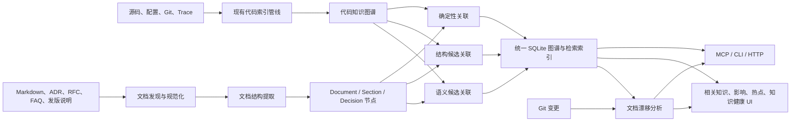

# 文档知识图谱与代码知识融合规划

> 状态（2026-09-20）：Markdown 图谱、双向引用及上下文/影响/评审接入已实现；人工质量验收、漂移和覆盖 UI 待推进
> 适用项目：Codebase Memory MCP  
> 核心方向：把分散的研发文档转化为可检索、可追踪、可验证、可与代码互相解释的知识层

## 1. 执行摘要

Codebase Memory MCP 已经能够建立源码、符号、调用、路由、配置、基础设施和跨服务关系图谱。提前交付的 Markdown MVP（对应原 20 周排期第 10 周的部分能力）已将仓库 Markdown 建模为可查询的 `Document` 和 `Section` 节点。2026-09-18 新增首批确定性 `REFERENCES` 与 `get_document` 证据返回，支持明确文件路径和完整 qualified name；完整关系质量、漂移检测和覆盖 UI 仍按后续阶段推进。完整阶段状态见[验收台账](MILESTONE_ACCEPTANCE.md)。

2026-09-20 已补齐 `get_related_documents` 反向查询及 `build_context`、`explain_impact`、`review_change` 相关文档接入。当前实现、参数和限制见 9.5 与第 11 节；其余目标架构、数据模型和阶段交付物是规划，不意味着已经提供相应接口、字段或 UI。63 条真实单行摘录回归仍待维护者复核，不代表整个 W11/W12 或完整文档知识图谱已经验收。

本规划建议将项目从“代码知识图谱”扩展为“代码与文档双层知识图谱”：

- 代码图谱继续作为确定性的分析底座。
- 文档被拆分为文档、章节、决策、问题、发版记录等可查询节点。
- 文档与代码通过明确引用、结构推断和语义候选三类证据建立关系。
- MCP 提供代码与文档的统一检索、关联解释和变更影响能力。
- UI 重点呈现相关知识、文档漂移和文档覆盖风险，而不是简单展示一张更大的图。

第一阶段只处理仓库内、可版本控制的 Markdown 文档，优先验证以下三个用户价值：

1. 选择代码符号时可以直接看到相关设计、说明和排查文档。
2. 分析代码变更时可以识别可能需要同步更新的文档。
3. 在热点分析中找出“代码风险高但文档覆盖不足”的区域。

## 2. 背景与问题

### 2.1 当前状态

现有代码图谱已经覆盖：

- 项目、目录、文件、模块、类、函数、方法、接口、路由和资源。
- 定义、调用、导入、继承、实现、使用、配置、数据流和跨服务关系。
- Git 变更影响、热点、架构、语义相关性、运行时 Trace 和跨仓库连接。
- MCP、CLI、HTTP、Desktop 控制台和图谱可视化。

Markdown MVP 交付前，文档只能被文件发现、全文搜索或按普通语法文件处理；当前 MVP 已补齐文档结构节点，但仍缺少以下能力：

- `Document` 与 `Section` 之外的决策、问题和发版记录专用节点。
- 章节已有结构身份；决策、问题和结论尚未形成独立语义实体。
- 已能返回明确引用的文件/完整符号；未提供明确引用的语义关联仍不推断。
- 已能返回提及变更代码的文档，但尚不能判断“哪些文档可能过期”。
- 无法衡量高风险代码是否有足够文档覆盖。
- 首批引用已有来源、置信度、行号与增量重建；更广的关系类型与质量校准仍待完成。

### 2.2 需要解决的核心问题

文档图谱建设不应只解决“文档能不能搜到”，还应解决：

1. **关联问题**：文档描述的概念、接口和方案由哪些代码实现。
2. **可信问题**：一条文档与代码关系是明确引用、结构推断还是语义猜测。
3. **时效问题**：文档是否已经落后于代码变化。
4. **覆盖问题**：哪些关键模块、接口和热点缺少文档。
5. **证据问题**：每个结论能否回到文档章节和代码位置进行核验。

## 3. 产品定位

### 3.1 一句话定位

将研发文档从仓库中的静态附件，升级为与代码图谱互相连接、可随变更持续校验的知识层。

### 3.2 目标

- 统一检索代码、文档、架构决策、问题记录和发版说明。
- 建立文档到代码、代码到文档的双向导航。
- 将现有变更影响分析扩展到文档影响。
- 将现有热点分析扩展到文档覆盖风险。
- 对所有推断关系保留来源、证据、置信度和生成版本。
- 保持本地优先、增量更新、低依赖和向后兼容。

### 3.3 非目标

以下内容不进入第一阶段：

- 不建设通用网盘或完整文档协作系统。
- 不自动重写或直接覆盖用户文档。
- 不在 MVP 中接入 PDF、DOCX、Jira、Jenkins、飞书或企业微信。
- 不把语义相似直接当作事实关系。
- 不要求用户部署外部向量数据库、图数据库或 LLM。
- 不在第一阶段解决组织级多租户和复杂权限继承。

## 4. 目标用户与核心场景

| 用户 | 核心问题 | 目标体验 |
|---|---|---|
| 新加入研发 | 不知道从哪里理解模块 | 从核心代码直接进入相关设计和说明 |
| 功能开发者 | 修改代码前不知道文档和上下游影响 | 在影响分析中同时看到代码、测试和文档 |
| 维护者 | 不知道哪些文档已经失效 | 收到有证据的文档漂移提示 |
| 架构师 | RFC 和实际实现是否一致 | 从文档反向查看实现路径和缺口 |
| 技术负责人 | 哪些高风险区域缺少知识沉淀 | 查看热点与文档覆盖矩阵 |
| AI Agent | 需要代码之外的设计意图和历史背景 | 通过统一查询获得最小、可核验的证据集 |

## 5. 产品原则

### 5.1 代码和文档是双层图谱，不是两套孤立系统

文档节点和代码节点应存在于统一的逻辑图模型中，共享项目、文件、路径、查询和权限上下文。物理存储可以分表，但查询层必须支持跨层路径。

### 5.2 确定性优先，语义能力用于召回

优先使用明确的文件路径、符号名、路由、配置键、提交号和链接建立关系。语义模型用于发现候选关系，不能独立确认高风险事实。

### 5.3 所有关系必须可解释

每条文档到代码的关系至少记录：

- 关系来源。
- 命中的文档范围。
- 命中的代码对象。
- 置信度。
- 建立时间和索引版本。
- 可选的匹配文本或结构特征。

### 5.4 UI 面向任务，不面向节点数量

默认不把所有文档章节直接加入 3D 图谱。用户首先看到的是相关文档、受影响文档、覆盖缺口和证据路径，需要时再展开混合图层。

### 5.5 本地优先和渐进增强

没有 embedding、外部连接器或远程服务时，确定性关系、全文搜索和基础 UI 仍应完整可用。

## 6. 目标架构



## 7. 文档数据模型

### 7.1 第一阶段节点

| 节点 | 说明 | 主要来源 |
|---|---|---|
| `Document` | 一篇完整文档 | Markdown 文件 |
| `Section` | 文档标题层级中的一个章节 | Markdown heading |
| `Decision` | 架构或技术决策 | ADR、RFC 决策段落 |
| `IssueKnowledge` | 问题现象、原因和处理步骤 | FAQ、排查文档 |
| `ReleaseNote` | 版本变更说明 | changelog、release notes |
| `Concept` | 跨文档复用的受控概念 | 后续阶段启用 |

MVP 必须实现 `Document` 和 `Section`。其他类型允许先作为带 `doc_type` 属性的 `Document` 或 `Section` 落库，待分类准确率稳定后再升级为独立节点。

### 7.2 核心属性

| 属性 | 用途 |
|---|---|
| `title` | 文档或章节标题 |
| `qualified_name` | 项目、路径和章节锚点组成的稳定名称 |
| `file_path` | 原始文件位置 |
| `anchor` | 章节锚点或行范围 |
| `content_hash` | 内容变化检测 |
| `source_kind` | `repo_markdown`、未来的 `jira`、`jenkins` 等 |
| `doc_type` | `readme`、`adr`、`rfc`、`faq`、`release_note` 等 |
| `updated_at` | 文档更新时间 |
| `git_commit` | 建图时对应的 Git 版本 |
| `owner` | 可选负责人或团队 |
| `visibility` | 为远程和组织级部署预留的可见范围 |
| `summary` | 可选的提取式摘要，不依赖 LLM |

### 7.3 第一阶段关系

| 关系 | 方向 | 含义 |
|---|---|---|
| `CONTAINS_SECTION` | Document -> Section | 文档章节结构 |
| `REFERENCES` | Document/Section -> Code/Document | 原文中存在明确引用 |
| `EXPLAINS` | Document/Section -> Code | 文档解释代码对象 |
| `IMPLEMENTED_BY` | Decision/Section -> Code | 方案由代码对象实现 |
| `AFFECTS` | Document/Section -> Code/Route/Config | 文档描述的影响范围 |
| `SUPERSEDES` | Document -> Document | 新文档替代旧文档 |
| `RELATES_TO` | Document/Section -> GraphNode | 通用的低确定性候选关系 |

`EXPLAINS`、`IMPLEMENTED_BY` 和 `AFFECTS` 在没有明确证据时不应自动生成。语义候选默认使用 `RELATES_TO`，避免把相关性误表述为事实。

## 8. 文档发现与解析

### 8.1 MVP 数据源

默认发现以下内容：

- 根目录 `README.md`、`CHANGELOG.md`。
- `docs/**/*.md`。
- `adr/**/*.md`、`docs/adr/**/*.md`。
- `rfc/**/*.md`、`docs/rfc/**/*.md`。
- `faq/**/*.md`、`docs/faq/**/*.md`。
- 文件名包含 `release-note`、`troubleshooting`、`runbook` 的 Markdown。

项目可在配置中增加或排除文档目录和类型映射。发现过程继续遵守 `.gitignore` 和 `.cbmignore`。

### 8.2 结构提取

MVP 解析以下 Markdown 结构：

- YAML front matter。
- H1-H6 标题层级。
- 普通段落和列表。
- 代码块及其语言。
- Markdown 链接和相对路径。
- 行内代码标记。
- 表格中的代码标识符和路径。

章节的稳定身份由项目、规范化文件路径、标题层级和内容指纹共同确定。仅依赖标题文本会在重名或章节移动时产生错误复用。

### 8.3 内容存储策略

- 原始文档仍以仓库文件为事实来源。
- 图节点保存标题、位置、摘要、哈希和必要的检索文本。
- 全文内容进入 FTS5 文档索引，不复制为大量无结构图节点。
- embedding 按章节生成，禁止按固定字符长度盲目切块。
- 代码块单独保留语言、行范围和所属章节，便于识别代码引用。

## 9. 文档与代码关联策略

### 9.1 一级：确定性关联

以下为目标证据类型；当前只实现 9.5 中明确文件链接、行内路径和完整 qualified name 子集，路由/配置/Git 关联仍为规划：

- Markdown 链接指向仓库文件。
- 文档中的规范化文件路径能够唯一匹配图谱文件节点。
- 完整 qualified name 能唯一匹配符号。
- 路由、配置键、环境变量或资源名称能唯一匹配已有节点。
- Git commit、PR 或 Issue 标识能够关联到现有 Git 元数据。

确定性关系的置信度建议为 `0.95-1.00`。

### 9.2 二级：结构候选关联

此级关联尚未实现；当前遇到不唯一目标时跳过，不返回结构候选列表。

候选证据包括：

- 反引号中的类名、函数名或配置键。
- 标题和章节中的模块、包、路由名称。
- 文档路径与代码包路径的邻近性。
- 同一章节内多个标识符共同指向同一模块。
- 代码块中的导入、调用或配置片段。

结构候选只有在消歧后才能升级为事实关系。存在多个同名符号时，应保留候选列表，不得随意选择。

### 9.3 三级：语义候选关联

此级文档关联尚未实现，不应根据代码语义搜索能力推断已经存在文档语义关系。

使用现有语义向量和图扩散能力召回概念名称不同但含义接近的代码。默认规则：

- 只生成 `RELATES_TO`。
- 保存相似度、图距离和共同结构信号。
- 默认 UI 不展示低于阈值的候选。
- 用户确认或显式规则可以将关系升级为 `EXPLAINS` 或 `IMPLEMENTED_BY`。

### 9.4 关系证据

每条自动关系建议包含：

```json
{
  "source": "explicit_link | symbol_match | path_match | structural | semantic",
  "confidence": 0.97,
  "document_span": {"start_line": 42, "end_line": 45},
  "matched_text": "PaymentService.retry",
  "target_qualified_name": "example.payment.PaymentService.retry",
  "index_version": 1
}
```

### 9.5 当前可用的本地引用功能

索引管线会在全量索引和增量更新后生成 `REFERENCES`：

- `[实现](../src/core.py)`：相对当前文档解析，目标必须是已索引文件。
- 行内代码 `` `src/core.py` ``：尝试文档相对路径与仓库相对路径，若指向两个不同目标则不连线。
- 行内代码 `` `example.src.core.compute` ``：只匹配完整 qualified name，不猜测短函数名。

引用归属包含该行的最近章节，否则归属文档；同一来源节点到同一目标保留首条证据。
边属性包含 `producer=document_links`、匹配方式、置信度、文档行范围、匹配文本和目标 QN。
代码改名/删除、文档删除引用后，增量索引会清理旧的自动引用，不删除其他来源的边。
旧索引在下一次索引时补建关联，不要求用户修改文件来触发。

通过现有 MCP/CLI 查询：

```json
{"project":"example","path":"docs/guide.md"}
```

将上述参数传给 `get_document`，除原有章节外还返回：

- `references[]`：来源 QN、目标文件/符号元数据和 `properties` 中的证据。
- `references_truncated`：最多返回按文档行号、目标 QN 稳定排序的前 100 条。
- `reference_analysis`：处理状态、支持范围和限制原因；旧索引返回 `unknown / reindex_required`。

当前是保守的 Markdown 子集，不是完整 CommonMark 解析：
忽略图片、外部链接、注释、fenced/缩进代码和引用块；
复杂或多行链接、转义路径、链接标题、reference-style links、短名消歧、
URL 编码路径及路由/配置键匹配尚未支持。
跨行代码跨度会标记 `limited / unsupported_multiline_code`；
读取失败也会标记 `limited`，恢复后普通重新索引可重试。
这里的 `ok` 只表示在声明的子集内处理完成，不代表所有文档引用均已覆盖。
这些关系只表示原文引用，不自动升级为 `EXPLAINS` 或 `IMPLEMENTED_BY`。

#### 2026-09-20：反向查询与开发工作流

`get_related_documents` 支持从代码反查引用它的文档。参数示例：

```json
{"project":"example","target":"example.src.core.compute","limit":20}
```

也可将 `target` 设为 `file:src/core.py`；文件目标同时查询该文件节点及其中符号的引用。
不接受短名猜测。`limit` 默认 20，上限 100；响应包含 `references[]` 中的
`source`、`target`、`properties`，以及总数、返回数、截断和分析状态。
来源保留文档/章节位置，证据保留匹配文本和引用行号。
状态是 best-effort 信号；空结果不等于不存在文档，也不证明文档覆盖完整。

开发工作流复用相同的确定性证据：

- `build_context` 显式设置 `include_docs:true` 时附带 `documentation_references` 对象。
  最多返回 8 条引用、检查 24 个代码目标，并与原有证据共享估算 token 预算；
  达到数量或预算限制时保留截断信息，不保证完整召回。
- `explain_impact` 默认 `include_docs:false`。启用后附带 `related_documentation`；
  `document_limit` 默认 20，上限 100。
- `review_change` 默认 `include_docs:true`，按 `changed_paths` 查询相关文档，
  返回同形状的 `related_documentation`，并计入估算预算。
  这些引用只说明文档提及被改代码，不自动判定文档已漂移或过期。

MCP 参数示例（CLI 使用同名工具及既有 JSON 参数入口）：

```json
{"project":"example","task":"修改 compute 的行为","target":"example.src.core.compute","include_docs":true}
```

上述参数传给 `build_context`；影响查询参数传给 `explain_impact`：

```json
{"project":"example","query":"src/core.py","target":"file:src/core.py","include_docs":true,"document_limit":20}
```

#### 真实文档摘录回归

`tests/fixtures/document_links_golden.json` 固定了 8 个仓库 Markdown 文件中的
63 个候选引用：33 个正例、30 个反例，逐条记录来源文件、原始行号、匹配文本和预期目标。
`scripts/eval-document-links.py` 核对来源后，通过本地 stdio 索引隔离 fixture，
再验证 `get_document` 的目标与行号证据，不使用 HTTP 或真实用户缓存。

fixture 保留每条原文行和相对目录，目标采用真实仓库路径下的最小 File stub。
因此它不验证原文周围的块结构，也不是全仓库精确率/召回率测量。
标注状态为 `maintainer_review_pending`，仍需维护者复核，不能将 63 条通过
当作“人工确认黄金集”或 W11 精确率门槛已经完成。

```bash
python scripts/eval-document-links.py --check-sources
python scripts/eval-document-links.py build/c/codebase-memory-mcp
python -m unittest discover -s tests -p test_eval_document_links.py
```

Windows 使用 `.exe` 二进制，可追加 `--temp-root C:/msys64/tmp` 指定非系统 ASCII
临时目录。来源漂移时应复核并更新样例，不自动重标注。

本轮验证记录（2026-09-20）：C 测试 255 通过、6 项平台跳过，上下文黄金回归 31/31，
摘录回归 63/63，评测脚本 Python 测试 11 项通过。记录仅覆盖对应测试范围，
不代表全仓库关系质量、漂移判定或文档 UI 已验收。

## 10. 文档漂移分析

本节为未实现的漂移设计。当前相关文档结果没有下述漂移状态，不应将引用命中或空结果转换为过期/无覆盖结论。

### 10.1 漂移信号

当以下情况出现时，将文档标记为“可能需要复核”，而不是直接判定错误：

- 关联符号已删除或重命名。
- 函数签名、路由或配置键发生变化。
- 文档关联模块出现高风险 Git 变更。
- 文档更新时间早于关联代码的多次重要变更。
- 文档中的路径、链接或 qualified name 已无法解析。
- 文档声明的实现集合和当前图谱存在明显差异。

### 10.2 状态模型

| 状态 | 说明 |
|---|---|
| `current` | 当前没有检测到漂移信号 |
| `review` | 存在需要人工确认的变化 |
| `stale` | 明确引用已经失效，或用户确认过期 |
| `orphan` | 文档没有任何可解释的项目内关联 |
| `unknown` | 缺少足够信息判断 |

### 10.3 关键约束

- 漂移检测只产生提示和证据，不自动修改原文。
- 代码高频变更不等于文档过期，必须结合关系类型和变更内容。
- 语义候选关系默认不参与高严重度漂移告警。

## 11. MCP 与查询能力

### 11.1 已实现的查询入口

当前公开工具及文档扩展如下；参数示例、限制和证据范围见 9.5：

| 工具 | 当前能力 |
|---|---|
| `search_graph` | 查找已索引的 `Document`、`Section` 节点 |
| `query_graph` | 查询已有文档结构和 `REFERENCES` 边 |
| `get_document` | 按 `project` 与 `path` 或 `name` 返回文档元数据、章节及最多 100 条引用证据 |
| `get_related_documents` | 按完整 QN 或 `file:仓库相对路径` 反查文档；文件目标包含文件内符号，`limit` 默认 20、上限 100 |
| `build_context` | 显式 `include_docs:true` 时返回有数量和估算 token 预算限制的 `documentation_references` |
| `explain_impact` | `include_docs` 默认 false；启用后返回 `related_documentation`，`document_limit` 默认 20、上限 100 |
| `review_change` | `include_docs` 默认 true；按变更路径返回 `related_documentation` 并计入估算预算 |
| `get_code_snippet` / `search_code` | 保持代码证据读取/搜索语义 |

`get_document` 和 `get_related_documents` 均为已实现的独立 MCP 工具，不是等待决策的新增提案。`get_document` 当前没有默认命中章节/可选全文读取模式，不应传入未声明的全文参数；精确调用 schema 以 `tools/list` 为准。引用、处理状态和截断字段是 best-effort 证据，不能证明完整覆盖。

### 11.2 后续接口规划（未实现）

- `detect_changes.affected_documents` 及漂移原因：尚未提供；当前使用 `review_change` 或 `explain_impact` 的 `related_documentation`。
- `get_architecture` 文档覆盖、孤立文档和漂移摘要：尚未提供。
- `unified_search`：尚未实现或注册，不是当前可调用工具。

`unified_search` 的候选设计：

同时检索文档和代码，并返回分组结果、关联证据和建议的下一步查询。

建议参数：

- `project`
- `query`
- `scope`: `all | code | docs`
- `doc_types`
- `limit`
- `include_related`

### 11.3 Agent 使用规则

2026-09-20 已同步安装器生成的 Agent 指令模板与 CLI 帮助；已有客户端文件需先查看
`install --dry-run` 计划再更新，不会随源码修改自动覆盖。使用规则如下：

- 单文件字面量查找继续优先使用 `rg`/`grep`。
- 查询设计意图、历史背景、跨文件关系或影响范围时优先调用 MCP。
- 从代码找说明时调用 `get_related_documents`；从文档找代码时调用 `get_document`。旧索引先重新索引补建关系，并使用新构建的 MCP 进程。
- `build_context` 和 `explain_impact` 需要文档时显式传 `include_docs:true`；`review_change` 默认启用，均需检查分析状态、预算和截断。
- MCP 返回的文档关系必须携带证据和置信度。
- 相关文档不等于漂移提示；需回读原文和代码后再形成更新结论，空结果不得解释为无文档。

## 12. UI 信息架构规划

本节文档专项 UI 均为后续规划。本轮仅交付 MCP/CLI 和组合工具数据，不代表现有图谱、影响或热点页已展示这些文档能力。

### 12.1 总体原则

文档能力首先嵌入现有任务流程，不在 MVP 中直接增加一个庞大的顶级“文档图谱”页面。

### 12.2 图谱页

增加 `代码 | 文档 | 混合` 分段控制：

- `代码`：保持当前默认体验。
- `文档`：显示文档层级和文档间关系。
- `混合`：只显示当前选中对象附近的跨层关系，不一次加载全部文档节点。

代码节点详情增加“相关知识”区域：

- 相关文档和章节。
- 文档类型和更新时间。
- 关系类型、置信度和证据。
- 漂移状态。
- 打开文档和查看关联路径操作。

文档节点详情增加：

- 文档目录和命中章节。
- 关联代码、路由、配置和测试。
- 原始文件位置。
- 覆盖范围和漂移状态。

### 12.3 影响页

现有变更传播结果增加“受影响文档”：

- 必须更新：明确引用已经失效。
- 建议复核：关联符号或调用路径发生重要变化。
- 低置信度候选：仅供探索，不进入默认计数。

每项结果应说明：

- 哪个变更触发。
- 哪条关系连接到文档。
- 命中文档的哪个章节。
- 为什么建议复核。

### 12.4 热点页

增加“代码风险与文档覆盖矩阵”：

| | 文档覆盖高 | 文档覆盖低 |
|---|---|---|
| 代码风险高 | 重点维护 | 优先补文档 |
| 代码风险低 | 正常区域 | 低优先级 |

建议风险得分继续复用调用度、变更频率、复杂度和跨服务影响；文档覆盖得分基于：

- 是否存在确定性关联文档。
- 是否覆盖入口、公共 API、配置和核心符号。
- 文档是否处于 `current` 状态。
- 是否存在 ADR、测试说明或排查说明。

### 12.5 索引列表与统计页

项目卡片增加简洁的知识健康摘要：

- 文档数量。
- 有文档覆盖的高风险符号比例。
- 待复核文档数量。
- 孤立文档数量。
- 最近文档索引时间。

详细统计进入展开面板，避免项目列表信息过载。

### 12.6 后续独立“知识”页

满足以下条件后再增加顶级“知识”页：

- 已支持至少三种文档类型。
- 文档与代码关系准确率达到验收标准。
- 用户需要跨项目浏览文档，而不只是从代码进入。

该页面可包含：

- 文档分类和搜索。
- 知识路径。
- 文档漂移队列。
- 无覆盖热点。
- 孤立文档。
- 文档到实现的追踪视图。

## 13. 存储、索引和兼容性

### 13.1 存储

- 继续使用现有 SQLite 图存储。
- 文档全文使用独立 FTS5 表，避免扩大常规图查询结果。
- 章节向量进入现有或兼容的语义索引。
- 文档节点和边进入现有节点/边模型，保持 Cypher 可查询。

### 13.2 增量更新

以下是目标优化策略；当前引用 pass 在全量/增量索引后重建其自身生成的自动引用，保留其他来源边，并支持旧索引补建。仅按受影响符号定向重评估仍是后续优化，不应据此承诺当前性能。

- 以文件哈希判断是否需要重新解析。
- 只重建变化文档的章节、全文索引、向量和关联边。
- 删除文档时清理所属章节和自动关系。
- 代码增量更新后，只重新评估与变更符号有关的文档候选。
- 关系生成器必须带版本号，算法升级后支持定向重建关系。

### 13.3 向后兼容

- 老版本数据库打开时自动迁移或按版本触发安全重建。
- 未启用文档索引的项目保持现有查询输出。
- 现有 MCP 工具字段只追加，不删除或改变语义。
- 3D 图谱默认仍为代码模式，避免旧项目视觉和性能回退。

## 14. 安全、隐私与权限

### 14.1 本地模式

- 文档内容和 embedding 默认留在本机。
- 不调用外部 LLM 或 embedding API。
- 遵守 `.gitignore`、`.cbmignore` 和允许根目录限制。
- 对可能包含密钥的文档应用现有敏感信息处理策略。

### 14.2 远程模式

进入组织级连接器阶段前必须补齐：

- 文档级可见范围。
- 项目和工具权限。
- 审计日志中的文档访问记录。
- 远程 MCP 返回内容的裁剪和脱敏。
- 外部系统 Token 的安全存储和轮换。

不同权限的文档不能通过关系、标题、计数或语义搜索侧信道泄露存在性。

## 15. 分阶段实施计划

### 阶段 0：模型和基线

目标：确定数据契约和质量基线。

交付物：

- `Document`、`Section` 节点和关系 Schema。
- 文档 qualified name、锚点和内容哈希规范。
- 10-20 篇覆盖 README、ADR、RFC、FAQ 的黄金测试文档。
- 文档到代码关系人工标注集。
- 数据库迁移和回滚策略。

验收：

- Schema 能表达计划中的 MVP 查询。
- 黄金集具有明确预期节点、章节和关系。
- 老项目数据库可以安全打开或重建。

### 阶段 1：仓库 Markdown 图谱

目标：让文档成为可查询的一等节点。

交付物：

- Markdown 发现、分类和增量解析。
- `Document`、`Section` 和 `CONTAINS_SECTION`。
- 文档 FTS5 搜索。
- `search_graph` 文档过滤和 `get_document`。
- 文档索引状态和覆盖统计。

验收：

- 标题层级、链接、代码块和行范围提取正确。
- 修改单篇文档只重建该文档相关数据。
- 删除和重命名文档后不存在孤儿章节。
- 未启用文档能力时现有索引性能无明显回退。

### 阶段 2：确定性代码关联

当前状态（2026-09-20）：文件/完整 QN 引用、证据和双向查询已实现；路由/配置匹配、候选列表、统一搜索和相关知识 UI 未实现；人工质量门槛仍待验收。

目标：形成可解释的代码与文档双向导航。

交付物：

- 路径、qualified name、路由、配置键和链接匹配。
- 消歧和候选关系机制。
- 关系证据和置信度存储。
- `unified_search`。
- 节点详情中的相关知识区域。

验收：

- 确定性关系精确率达到 95% 以上。
- 同名符号无法唯一确认时不自动建立事实关系。
- 任意关系都可以回到文档行范围和代码节点核验。

### 阶段 3：影响与热点 UI

当前状态（2026-09-20）：`build_context`、`explain_impact`、`review_change` 文档证据已接入；下列 `detect_changes` 字段、UI、覆盖和漂移能力仍是后续交付物。

目标：把文档能力转化为明确的开发和治理价值。

交付物：

- `detect_changes.affected_documents`。
- 影响页“受影响文档”。
- 热点页“代码风险与文档覆盖矩阵”。
- 项目卡片知识健康摘要。
- 代码、文档、混合图层切换。

验收：

- 用户可以从一次 Git 变更定位到需要复核的文档和证据。
- 用户可以找到高风险、低覆盖模块。
- 混合图层不会默认加载整个文档图导致界面失控。
- 桌面和常见移动宽度下不存在文本或控件重叠。

### 阶段 4：漂移与语义关联

目标：发现名称不一致的知识，并持续校验文档时效。

交付物：

- `current/review/stale/orphan/unknown` 状态。
- 结构候选和语义候选关系。
- 文档漂移队列和证据视图。
- 用户确认、忽略和关系升级机制。

验收：

- 高严重度漂移只依赖确定性或用户确认关系。
- 语义候选可以单独关闭。
- 用户操作能够稳定保留，不会被下一次索引覆盖。

### 阶段 5：企业连接器与团队服务

目标：将仓库知识扩展到研发流程。

候选范围：

- Jira Issue 和处理结论。
- Jenkins 构建失败和修复记录。
- GitHub/GitLab PR、Issue 和 Release。
- 飞书、企业微信或内部知识库。
- 带权限和审计的远程 MCP。

进入条件：

- 仓库内文档图谱准确性和 UI 价值已经验证。
- 权限模型可以防止跨项目和跨文档泄露。
- 外部连接器失败不会阻塞本地索引。

## 16. 成功指标

### 16.1 数据质量

- 文档发现召回率。
- 章节结构准确率。
- 确定性关系精确率和召回率。
- 同名符号误关联率。
- 失效路径和链接检出率。

### 16.2 产品价值

- 从代码节点进入相关文档的使用次数。
- 影响分析中被用户确认的受影响文档比例。
- 高风险符号文档覆盖率。
- 漂移提示的确认率和误报率。
- 用户定位设计意图所需的平均操作次数。

### 16.3 性能

- 文档增量索引耗时。
- 统一搜索 P50/P95 延迟。
- 文档能力启用前后的数据库大小变化。
- 图谱首屏节点数量和渲染时间。
- 代码索引吞吐的回退比例。

建议门槛：

- 确定性关系精确率不低于 95%。
- 统一搜索 P95 在本地常规项目中低于 300ms。
- 文档能力对纯代码索引总耗时的增量控制在 15% 以内。
- 默认图谱首屏性能与现有版本基本一致。

具体数值应在阶段 0 基线测试后校准。

## 17. 测试策略

### 17.1 单元测试

- Markdown 标题层级、链接、代码块和 front matter。
- 路径规范化和章节稳定标识。
- 符号匹配、消歧和置信度。
- 文档分类和状态转换。
- 关系证据序列化。

### 17.2 集成测试

- 文档首次索引、增量修改、删除和重命名。
- 代码变更触发文档关联重评估。
- 老数据库迁移和新数据库回退。
- MCP、CLI、HTTP 返回一致性。
- 文档 FTS、图查询和统一搜索排序。

### 17.3 质量评测

- 建立人工标注的文档与代码关系黄金集。
- 分开统计确定性、结构和语义三类关系。
- 评测必须包含同名符号、过时路径、跨仓库文档和无关文档。
- 漂移评测同时统计真实检出和误报。

### 17.4 UI 测试

- 节点详情中的相关知识状态。
- 影响页的文档证据链。
- 热点覆盖矩阵排序和筛选。
- 大量文档下的分页、虚拟化和空状态。
- 桌面及移动视口截图回归。

## 18. 主要风险与应对

| 风险 | 影响 | 应对 |
|---|---|---|
| 语义误关联 | AI 和用户获得错误背景 | 语义关系降级为候选，保留证据，不进入高严重度告警 |
| 文档节点过多 | 查询和可视化变慢 | 以章节为最小语义单位，默认不展开全文块和全量混合图 |
| 同名符号 | 建立错误实现关系 | 必须结合路径、包、语言和上下文消歧 |
| 文档频繁移动 | 节点身份不稳定 | 使用路径、标题层级、内容指纹和 Git 重命名信息联合匹配 |
| 索引时间增加 | 影响现有核心体验 | 文档独立增量管线，可配置关闭，建立性能预算 |
| 文档包含敏感信息 | 远程查询泄露 | 本地优先、权限过滤、审计、脱敏和连接器隔离 |
| UI 信息过载 | 图谱不可读 | 任务视图优先，混合关系按选中对象局部展开 |
| 自动状态被误解为事实 | 用户错误处理文档 | 使用“建议复核”措辞并始终展示触发证据 |

## 19. 待决策事项

已确定并实现：

- `Document`、`Section` 及引用边复用现有节点/边模型。
- `get_document`、`get_related_documents` 作为独立公开 MCP 工具，CLI 使用同名入口。
- 当前仅把明确路径和完整 QN 生成的 `REFERENCES` 作为确定性文档证据；不能唯一确认时跳过。

后续仍需决策：

1. 独立文档全文/章节向量存储和 `unified_search` 的接口及预算。
2. 文档专用发现、类型映射和单独启停配置如何扩展现有索引规则。
3. 用户确认关系存放在数据库、仓库配置还是独立 sidecar 文件。
4. 文档类型显式声明与规则分类如何结合。
5. 共享图谱中的文档全文和 embedding 包含策略。
6. 远程文档级可见范围如何映射到项目和用户身份。

仓库内可审计 sidecar、专用全文表和 front matter 优先分类仍是候选方案，不是当前已支持的配置承诺。

## 20. MVP 完成定义

以下是完整文档产品 MVP 的退出条件，并非当前全部完成项；本地引用与工作流接入不替代 UI、质量和性能验收。

MVP 在满足以下条件时视为完成：

- 仓库 Markdown 可以增量生成 `Document` 和 `Section` 节点。
- 用户可以搜索文档并读取命中章节。
- 文档可以通过路径和唯一符号名连接到代码。
- 所有自动关系包含证据和置信度。
- 代码节点详情可以显示相关文档。
- Git 变更分析可以返回基于确定性关系的受影响文档。
- 热点页可以识别高风险、低文档覆盖模块。
- 文档能力可以配置关闭，关闭后现有行为和性能不发生明显变化。
- 数据库迁移、删除、重命名、重建和共享图谱流程均有测试覆盖。

## 21. 建议立即开展的下一步

1. 维护者复核现有 63 条摘录标注，明确正负例和支持子集边界。
2. 补充整篇原文块上下文和三个真实项目样本，独立测量精确率/召回率，不以摘录通过率替代。
3. 用真实变更验证双向查询与三项组合工具的文档证据、预算、截断和增量维护。
4. 在代码节点详情中制作“相关知识”最小 UI，再接影响页和覆盖矩阵。
5. 为漂移判断冻结独立状态/证据契约，确认质量门槛后再实现；当前引用结果不承担漂移结论。
6. 依据真实样例决定是否扩展路由/配置匹配，保持无法唯一确认时不建立事实关系。

完成以上步骤后，再决定是否进入语义关联和外部企业连接器阶段。
