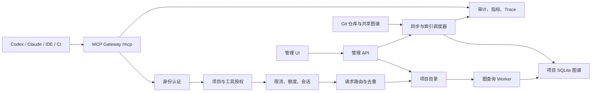
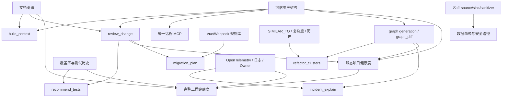

# Codebase Memory MCP 产品研发路线图

> 状态：规划草案
> 规划对象：文档知识图谱、统一远程 MCP 服务、项目健康度、Agent 决策工具和组织级软件资产图谱
> 关联规划：[文档知识图谱与代码知识融合规划](DOCUMENT_KNOWLEDGE_GRAPH_PLAN.md)
> 周排期：[每日 100 美元 Token 预算下的 20 周交付计划](DELIVERY_SCHEDULE.md)
> 现有能力说明：[Remote MCP deployment](REMOTE_MCP.md)

## 1. 执行结论

下一阶段不应继续无序增加底层图关系，而应把现有代码图谱转化为可直接支持研发决策的产品能力。

建议路线分为五层：

1. **可信层**：所有高层结论携带索引版本、Git commit、生成时间、覆盖缺口、截断状态和证据置信度。
2. **服务层**：将现有远程 MCP 升级为多用户、项目隔离、可调度、可观测的统一服务。
3. **知识层**：建设文档与代码双层图谱，让设计、问题、决策和发版说明进入影响分析。
4. **决策层**：优先交付 `build_context`、`review_change` 和项目健康度，把现有原子工具组合成任务级结果。
5. **演进层**：逐步补齐测试推荐、迁移规划、重构雷达、图谱差异、故障解释和数据血缘。

总体优先级：

| 优先级 | 能力 | 结论 |
|---|---|---|
| P0 | 可信响应契约 | 所有后续能力的前置条件，立即建设 |
| P1 | 统一远程 MCP Server | 现有底座成熟，重点补多用户和项目治理 |
| P1 | `build_context` | 最符合 MCP 使用方式，可直接复用现有工具 |
| P1 | `review_change` | 现有影响、复杂度和测试关系已覆盖大部分底座 |
| P1-P2 | 文档知识图谱 | 先做仓库 Markdown，再接影响和热点 UI |
| P1-P2 | 项目健康度 | 先做静态健康度，再接测试、文档和运行时质量 |
| P2 | `recommend_tests` | 需要 LCOV/JaCoCo、历史测试和运行时覆盖 |
| P2 | 定向 `migration_plan` | 聚焦 Vue 2->3、Webpack->Vite，不先做通用迁移引擎 |
| P2-P3 | `refactor_clusters` | 底层相似性已具备，需要意图重复过滤和收益评分 |
| P3 | `graph_diff` | 先完成图谱代际标识，再建设快照和架构漂移 |
| P3 | `incident_explain` | 依赖 OpenTelemetry、日志和事故系统连接器 |
| P4 / 研究 | 数据血缘与安全路径 | 价值高但正确性责任重，需独立污点分析体系 |

## 2. 当前能力基线

### 2.1 已具备的分析底座

当前 `TOOLS[]` 已经包含 16 个原子 MCP 工具，主要覆盖：

- 索引、项目列表、状态和覆盖缺口。
- 结构搜索、全文搜索、语义搜索和源码读取。
- 调用、数据流、跨服务路径和影响解释。
- Git diff、架构、复杂度、热点、ADR 和运行时 Trace。
- 只读 Cypher 查询和跨仓库关系。

当前图谱还具有：

- 函数和方法复杂度、认知复杂度、循环与递归信号。
- `SIMILAR_TO`、语义相关性和社区聚类。
- 测试文件识别和影响路径中的测试节点。
- Git 历史共变、共享压缩图谱和跨服务关系。

因此，近期重点不应是再复制一组功能相近的原子查询，而应提供有预算、有证据、有排序的组合型工具。

### 2.2 已具备的远程 MCP 底座

当前 `serve` 已支持：

- MCP Streamable HTTP，入口为 `POST /mcp`。
- Bearer Token 鉴权。
- `analysis` 和 `scout` 受限工具面，拒绝远程 unrestricted profile。
- 按 `Mcp-Session-Id` 隔离会话，并绑定客户端 IP。
- 会话 TTL、最大会话数和最大工作线程数。
- 可信代理解析和反向代理部署。
- 请求级审计日志，不记录完整查询正文和 Token。
- 拒绝带 `Origin` 的浏览器请求。

它已经是安全的单服务原型，但还不是可供团队统一使用的产品化平台。

### 2.3 当前关键缺口

- 单一共享 Token，不能识别真实用户或服务账号。
- 没有项目级 ACL、工具级权限和源码读取权限拆分。
- 审计 `principal` 当前主要退化为 IP，NAT 环境无法对应个人。
- 没有统一项目目录、远程 Git 同步和索引任务调度。
- 没有限流、额度、查询缓存、相同索引任务去重和优先级队列。
- 没有服务健康、请求延迟、会话、索引队列和错误率管理 UI。
- 没有高层响应的统一新鲜度、覆盖度和置信度契约。
- 文档、需求、事故、Owner 和 CI 结果尚未成为一等图节点。

## 3. 研发原则

### 3.1 先保证结论可信，再增加结论数量

静态图谱无法保证覆盖反射、动态注册、运行时生成代码和所有事件关系。高层工具必须明确区分：

- 已由当前图谱和源码证据确认的事实。
- 基于结构路径推断的影响。
- 基于语义或启发式生成的候选。
- 因索引过期、文件未覆盖或结果截断而无法确认的范围。

### 3.2 原子工具保持稳定，高层工具负责产品语义

`search_graph`、`trace_path`、`query_graph` 等继续提供可组合的确定性能力；`build_context`、`review_change` 等负责：

- 调用多个原子工具。
- 去重和排序。
- 控制 Token 预算。
- 汇总证据和局限。
- 输出面向具体任务的稳定 Schema。

### 3.3 远程控制面与 MCP 数据面分离

- MCP 数据面只负责 Agent 查询和允许的任务。
- 管理 API 负责项目、身份、权限、索引任务和服务配置。
- 管理 UI 不直接复用 MCP 工具作为管理接口。
- 任何远程索引和删除操作都必须有独立权限和审计。

### 3.4 单节点产品化优先于分布式架构

第一版统一服务器以单节点、多个项目、多个身份为目标。只有容量基准证明单节点不足后，才引入外部队列、分布式存储和多副本一致性。

### 3.5 垂直场景先于通用平台

迁移规划先聚焦已有优势明显的 Vue 2/Webpack；测试推荐先支持 LCOV 和 JaCoCo；故障定位先支持 OpenTelemetry。每项能力通过真实项目验证后再抽象通用框架。

## 4. P0：可信响应契约

### 4.1 目标

让用户和 Agent 能判断当前结果是否足够新、足够完整、是否被截断，以及证据属于哪种可靠等级。

### 4.2 统一元数据

所有组合型工具必须返回：

```json
{
  "analysis_meta": {
    "project": "example",
    "graph_generation": "gen-20260810-001",
    "indexed_commit": "abc123",
    "working_tree_state": "clean | dirty | unavailable",
    "generated_at": "2026-08-10T10:00:00Z",
    "freshness": "current | stale | unknown",
    "coverage": "complete_no_known_gap | partial | unknown",
    "truncated": false,
    "confidence": "high | medium | low"
  }
}
```

其中 `complete_no_known_gap` 只表示没有记录到已知缺口，不得解释为绝对完整。

### 4.3 结论策略

- 原子查询可以在图谱过期时继续返回结果，但必须附带警告。
- PR 门禁、精准测试推荐和文档漂移等高风险结论在图谱明显过期时应拒绝给出“确定通过”。
- 任何分页或节点上限截断必须进入顶层元数据。
- 每个关键结论至少关联一个图路径、源码位置、文档位置或运行时证据。

### 4.4 P0 验收标准

- `build_context`、`review_change` 等组合工具 100% 返回统一元数据。
- 图谱 commit 落后目标 diff 时，PR 门禁不会返回无条件通过。
- 已知 parse gap、excluded scope 和分页截断能稳定进入响应。
- 工具清单、README、CLI help 和 MCP `tools/list` 数量保持一致。
- 建立覆盖新鲜、过期、dirty、无 Git、部分索引和截断场景的测试矩阵。

## 5. P1：统一远程 MCP Server

### 5.1 产品目标

团队成员只配置一个远程 MCP 地址，即可在权限范围内查询多个项目的最新代码与文档图谱；管理员可以统一维护仓库、索引、身份、权限、配额和审计。

### 5.2 目标架构



### 5.3 数据面

继续使用标准 MCP Streamable HTTP：

- `POST /mcp`：初始化、工具列表和工具调用。
- `DELETE /mcp`：释放会话。
- 保持现有 MCP 客户端兼容。
- 长时间索引不占用同步工具请求，改为异步任务和状态查询。

数据面新增：

- 多凭证身份解析。
- 授权后工具列表裁剪。
- 项目参数 ACL 校验。
- `list_projects` 只返回当前身份可见项目。
- `get_code_snippet` 作为单独的源码读取权限。
- 每次调用注入 `principal`、`request_id` 和授权范围到审计上下文。

### 5.4 控制面

建议增加独立管理 API：

| API | 用途 |
|---|---|
| `GET /admin/v1/projects` | 项目目录、索引状态和 generation |
| `POST /admin/v1/projects` | 注册本地或 Git 项目 |
| `POST /admin/v1/projects/{id}/sync` | 拉取并更新图谱 |
| `GET /admin/v1/jobs` | 索引和同步任务队列 |
| `GET /admin/v1/principals` | 用户或服务身份列表 |
| `PUT /admin/v1/policies/{id}` | 项目、工具和源码读取权限 |
| `GET /admin/v1/audit` | 受限审计检索 |
| `GET /healthz` | 进程存活 |
| `GET /readyz` | 存储、目录和调度器可用性 |
| `GET /metrics` | 延迟、错误、队列和资源指标 |

管理 API 必须与 `/mcp` 使用不同的认证 Scope，默认不对公网开放。

### 5.5 身份与权限

MVP：

- 支持多个随机 API Key。
- 服务端只保存 Key 哈希、Key ID、主体和 Scope。
- 支持用户身份和 CI 服务账号。
- 策略粒度至少包含项目、工具 Profile、源码读取、索引和删除。
- 允许一个主体访问多个项目，一个项目授权给多个主体。

后续：

- OIDC/OAuth2 和企业身份提供方。
- 组、团队和组织继承。
- 短期凭证和自动轮换。
- 细粒度文档可见性。

### 5.6 请求调度

查询请求：

- 按主体和项目限流。
- 配置并发上限和超时。
- 用 `graph_generation + tool + normalized_args + auth_scope` 构建安全缓存键。
- 不跨权限 Scope 共享可能包含源码的缓存。

索引请求：

- 同一项目、commit 和模式的任务去重。
- 一个项目同一时间只允许一个写任务。
- 查询继续读取上一代完整图谱，索引完成后原子切换 generation。
- 提供取消、失败重试和指数退避。
- Git 拉取失败与索引失败分开记录。

### 5.7 统一项目目录

每个项目至少记录：

- 稳定项目 ID 和显示名称。
- 本地路径或 Git URL。
- 默认分支和同步策略。
- 当前 graph generation、Git commit 和索引模式。
- 最近成功和最近失败时间。
- 文档索引状态。
- Owner、可见范围和策略 ID。

### 5.8 管理 UI

在现有控制台增加“远程服务”工作区：

- 服务状态、地址和版本。
- 当前会话、请求频率、P95 延迟和错误率。
- 项目目录、最近同步、generation 和覆盖缺口。
- 索引任务队列、失败原因和重试。
- 主体与项目授权关系。
- 审计事件筛选。

UI 不显示完整 API Key，只允许创建时显示一次，并支持撤销和轮换。

### 5.9 MVP 部署边界

- 单进程、单节点、多项目。
- SQLite 项目图谱仍保存在本机磁盘。
- TLS 继续由 Nginx、Caddy 或企业网关终止。
- 不在 MVP 中实现多节点 HA 和共享写存储。
- Git 凭证由部署环境提供，不写入项目数据库。

### 5.10 远程服务验收标准

- 至少支持用户 Key、CI Key 和管理员 Key 三类身份。
- 项目、工具和源码读取权限均有拒绝测试，不能通过参数绕过。
- `list_projects` 不泄露无权项目名称和数量。
- 20 个并发 MCP 会话和 1000 次混合查询的 soak 无会话串扰。
- 查询 P95 在不含索引任务时低于 1 秒，具体目标按基准机器校准。
- 同项目重复索引只产生一个实际任务。
- 写入新 generation 时，查询不会观察到半成品图谱。
- 审计记录可以对应真实 principal、项目、工具、状态和延迟。

## 6. P1：`build_context` 上下文编译器

### 6.1 产品价值

将“让 Agent 自己连续调用多个工具并拼接结果”升级为“服务器按任务和预算生成可核验的上下文包”。这是最符合 MCP 使用方式、也最能直接减少 Token 和工具调用的功能。

### 6.2 输入

- `project`
- `task`: 自然语言任务、错误信息或目标描述
- `target`: 可选文件、符号、路由或组件
- `diff_ref`: 可选 Git diff 范围
- `token_budget`
- `include_docs`
- `include_tests`
- `evidence_level`: `scout | analysis | audit`

### 6.3 输出

- 任务解析和目标消歧。
- 最相关符号与精简源码片段。
- 调用、依赖、数据流和跨服务链路。
- 相关测试。
- 相关 ADR、RFC、FAQ 和发版说明。
- 索引覆盖缺口和新鲜度。
- 建议后续读取或验证的对象。

### 6.4 编排策略

1. 解析任务中的明确路径、符号、路由和错误标识。
2. 使用结构搜索和 BM25 建立候选。
3. 使用语义搜索补充召回，不直接决定事实。
4. 沿高价值关系扩展有限深度。
5. 优先保留定义、变更点、入口、边界、测试和明确文档证据。
6. 按 qualified name、文件范围和关系路径去重。
7. 按 Token 预算裁剪，保留被裁剪数量和原因。

### 6.5 排序建议

候选得分由以下信号组成：

- 与任务的精确匹配和 BM25 分数。
- 是否位于 diff 范围。
- 图距离和关系类型。
- 是否为入口、公共 API、测试或架构边界。
- 运行时频次。
- 文档关系置信度。
- 覆盖缺口和 vendored/generated 噪声惩罚。

### 6.6 验收标准

- 实际输出 Token 不超过预算 10%。
- 同一符号和源码范围不会重复出现。
- 每个关系结论可回到路径或边证据。
- 在黄金任务集上，关键符号召回率优于 Agent 自行调用固定三次工具的基线。
- 低覆盖或过期索引时不会生成无条件确定结论。
- 不提供 `task` 或目标过于模糊时返回候选，不擅自选择。

## 7. P1：`review_change` PR 风险门禁

### 7.1 当前可复用能力

- `detect_changes` 提取 Git diff 和变更符号。
- `explain_impact` 返回直接、间接影响、入口、测试和跨服务信号。
- 图节点包含复杂度、循环、递归、导出和测试属性。
- 架构查询可以识别边界、包和依赖方向。

### 7.2 需要新增

- 基于 merge-base 的统一 diff 语义和重复文件去重。
- 公共 API、路由、Schema、配置和数据库迁移变化识别。
- 复杂度和热点的前后对比。
- 架构策略 DSL。
- CODEOWNERS、Git blame 或显式 Owner 规则。
- 测试缺口和覆盖变化。
- 可信层元数据和门禁策略。

### 7.3 输出模型

- 总体风险和门禁结论：`pass | warn | block | unknown`。
- 变更摘要。
- 直接和间接影响。
- 公共 API 和跨服务契约变化。
- 复杂度、循环和依赖边界变化。
- 受影响测试和缺失测试。
- 相关文档和可能需要复核的说明。
- 推荐评审人及证据。
- 所有阻断规则的规则 ID 和命中证据。

### 7.4 门禁原则

- 图谱过期、覆盖未知或结果截断时不能给出 `pass`。
- 规则命中和模型/启发式建议分开输出。
- 初期只在 CI 中评论，不直接阻断合并。
- 误报率达到目标后，按规则逐项启用 block。
- 用户必须能从 UI 或 CI 报告回到源码、关系路径和规则定义。

### 7.5 验收标准

- 同一个 diff 在 CLI、MCP 和 CI 中产生一致结果。
- 公共 API、复杂度和架构规则具有独立黄金测试集。
- `unknown` 不会被 CI 解释为 `pass`。
- 推荐评审人必须来自 CODEOWNERS、显式 Owner 或可解释历史证据。
- 试运行阶段统计每条规则的命中、确认、忽略和误报率。

## 8. 文档知识图谱产品线

详细技术与 UI 规划见 [DOCUMENT_KNOWLEDGE_GRAPH_PLAN.md](DOCUMENT_KNOWLEDGE_GRAPH_PLAN.md)。在总路线图中按以下节奏推进：

### P1：文档结构进入图谱

- 仓库内 README、ADR、RFC、FAQ 和发版说明。
- `Document`、`Section`、全文索引和增量生命周期。
- `get_document` 和基础文档搜索。

### P2：文档与代码双向关联

- 路径、qualified name、路由和配置键确定性关系。
- 代码节点“相关知识”。
- 影响页“受影响文档”。
- 热点页“代码风险与文档覆盖矩阵”。

### P3：漂移和外部知识

- 文档漂移状态和证据队列。
- 语义候选关系和人工确认。
- GitHub/GitLab、Jira、Jenkins 等连接器。

文档关系将直接增强 `build_context`、`review_change`、迁移规划和故障解释，不应作为孤立功能开发。

## 9. 图片候选能力评估

### 9.1 总览

| 能力 | 当前基础 | 主要缺口 | 产品价值 | 工程量 | 决策 |
|---|---|---|---:|---:|---|
| 可信响应契约 | 覆盖缺口、索引状态、证据字段已有部分基础 | generation、新鲜度和统一策略 | 5/5 | M | P0 立即做 |
| `build_context` | 16 个原子工具、搜索、影响、ADR | 编排、排序、去重、预算 | 5/5 | M | P1 主功能 |
| `review_change` | diff、影响、复杂度、测试节点 | 规则、前后对比、Owner、CI | 5/5 | M-L | P1 主功能 |
| 文档知识图谱 | Markdown 可发现、FTS/语义底座 | 一等节点、关系、漂移、UI | 5/5 | L | P1-P2 主线 |
| 统一远程 MCP | HTTP、Token、会话、审计 | 身份、ACL、调度、管理 UI | 5/5 | L | P1 平台主线 |
| 项目健康度 | 关系、复杂度、热点、社区和 Git 历史 | 评分基线、趋势、证据和覆盖数据 | 5/5 | M-L | P1-P2 产品主线 |
| `recommend_tests` | 测试识别、影响路径 | 覆盖率、测试历史、最小集合 | 4/5 | L | P2 |
| 定向 `migration_plan` | Vue/Webpack 解析和影响分析 | 规则库、兼容性和任务模板 | 4/5 | M-L | P2 垂直产品 |
| `refactor_clusters` | SIMILAR_TO、语义、复杂度、聚类 | 意图重复过滤、收益和风险 | 4/5 | M | P2-P3 |
| `graph_diff` | 共享快照、Git generation 基础 | 版本库、差异语义、策略 DSL | 4/5 | L | P3 |
| `incident_explain` | 简单 Trace ingest、跨服务图 | OTel、日志、事故和 Owner | 3.5/5 | XL | P3 |
| 数据血缘与安全路径 | 参数级数据流、路由和配置关系 | source/sink、污点、净化语义 | 3.5/5 | XL | P4/研究 |

### 9.2 `recommend_tests` 精准测试推荐

值得做，但必须等待覆盖率和测试执行数据进入图谱。

推荐数据源：

- LCOV。
- JaCoCo XML。
- pytest coverage XML。
- Go cover profile。
- 历史 CI 测试结果和耗时。
- 运行时 Trace。

推荐算法：

1. changed line -> coverage -> tests，作为最高置信度。
2. changed symbol -> `TESTS`/调用路径 -> tests。
3. changed route/service -> 集成测试和契约测试。
4. 用历史失败相关性补充排序。
5. 以覆盖最大化、耗时最小化求贪心近似最小集合。

输出必须同时给出推荐测试、覆盖理由、预计耗时、未覆盖变更和置信度。没有覆盖数据时应明确退化为“影响测试候选”，不能宣称精准最小集合。

### 9.3 `refactor_clusters` 重构雷达

值得做，当前底层成熟度高于表面看起来的程度。已有近克隆、语义相关、复杂度和社区聚类，可以组合出候选克隆族。

主要风险是把模板代码、协议实现、测试夹具和有意分叉当作坏重复。必须新增：

- generated/vendor/test fixture 排除。
- 有意重复白名单。
- 变化历史和 Owner 边界。
- 抽取公共实现后的依赖方向和影响面模拟。
- 收益评分：重复行数、变化频率、缺陷历史、复杂度下降。

第一版只输出候选和证据，不自动重构。

### 9.4 `migration_plan` 迁移规划

值得做，但只做垂直场景：

- Vue 2 -> Vue 3。
- Webpack -> Vite。
- Vuex -> Pinia 可作为后续扩展。

输入为项目和目标迁移，输出：

- 不兼容 API 和配置。
- 受影响组件、插件、loader、alias 和构建脚本。
- 基于依赖图的迁移批次。
- 每批次前置条件、回归测试和风险。
- 可并行任务和阻塞链路。

通用“任意框架到任意框架”的迁移引擎暂不建设，因为规则维护成本和误导风险过高。

### 9.5 `graph_diff` 架构漂移

价值高，但需要先完成可信层中的 graph generation。

推荐分两步：

1. **轻量 diff**：当前 generation 与指定 Git ref 重新构建的临时图比较。
2. **持久快照**：保存关键版本摘要和可选完整快照。

差异应覆盖：

- 新增和删除节点、边。
- 公共 API、路由和跨服务契约。
- 新增循环、反向依赖和边界穿透。
- 热点、复杂度和社区归属变化。
- 文档覆盖和漂移变化。

不建议保存每个 commit 的完整 SQLite 图谱；默认保存摘要、Merkle/哈希和关键版本快照。

### 9.6 `incident_explain` 故障定位

长期价值高，但当前 Trace ingest 只接收 caller、callee、count，距离生产事故解释仍有明显差距。

需要先接入：

- OpenTelemetry trace/span。
- service、route、status、duration 和 error 属性。
- 日志中的 trace ID、错误码和关键异常。
- 部署版本、近期变更和 Owner。
- 事故系统或工单链接。

目标证据链：

```text
故障入口 -> 运行时异常 Span -> 服务调用链 -> 对应代码符号
         -> 近期变更 -> 相关 Owner -> 历史事故/文档
```

第一版只做离线事故包导入和解释，不直接连接生产实时流。

### 9.7 数据血缘与安全路径

该方向具有独立安全产品的复杂度，不能只扩展现有 `DATA_FLOWS` 后就宣称具备漏洞检测能力。

需要独立建设：

- source：HTTP 参数、消息、文件、数据库和环境变量。
- sink：SQL、命令执行、模板渲染、网络发送和日志。
- sanitizer：校验、编码、参数化查询和权限检查。
- 字段敏感性、跨函数污点摘要和框架规则。
- 可解释的 source-to-sink 路径和误报管理。

近期仅做研究原型和黄金样本，不进入默认产品承诺。

## 10. P1-P2：项目健康度与质量分析

### 10.1 产品目标

把调用、依赖、复杂度、影响面、测试、文档和运行时数据转化为可解释的项目质量视图，帮助研发快速识别最值得处理的结构风险。

项目健康度不能只是一个总分。每次结果必须同时展示：

- 分项得分。
- 相对上一 generation 或版本的趋势。
- 数据覆盖范围。
- 结论置信度。
- 扣分问题和具体证据。
- 当前无法评价的维度。

### 10.2 评分维度

| 维度 | 主要指标 | 回答的问题 |
|---|---|---|
| 关系完整性 | 未解析调用、失效导入、悬空配置、疑似孤立符号 | 项目关系是否完整可靠 |
| 模块边界 | 循环依赖、跨层调用、内聚度、耦合度、公共接口膨胀 | 模块封装和分层是否合理 |
| 变更风险 | 入站调用、爆炸半径、热点集中、历史共变、跨服务影响 | 修改是否容易牵一发动全身 |
| 可维护性 | 圈复杂度、认知复杂度、超长函数、深层循环、递归、重复代码 | 代码是否容易理解和修改 |
| 测试保护 | 关联测试、行覆盖、变更覆盖、历史失败和预计耗时 | 修改是否有足够测试兜底 |
| 文档健康 | 核心模块覆盖、过期文档、孤立文档、ADR/RFC 关联 | 知识是否完整并与实现一致 |
| 运行时健康 | 错误率、慢链路、静态与运行时路径差异 | 生产事实是否支持静态判断 |

“空引用”统一拆成更准确的诊断：

- 无法解析目标的调用或导入。
- 已删除目标仍被引用。
- 指向不存在文件的配置和文档链接。
- 没有实现的接口或契约。
- 没有静态使用者的疑似孤立符号。

入度为 0 不能直接判定死代码。入口、导出 API、反射、依赖注入和框架注册必须进入例外和置信度判断。

### 10.3 MVP 静态健康度

第一版只计算当前图谱已经能够稳定提供的“静态代码健康度”：

| 维度 | 建议权重 |
|---|---:|
| 关系完整性 | 30% |
| 模块边界 | 25% |
| 变更风险 | 25% |
| 可维护性 | 20% |

测试保护、文档健康和运行时健康先作为独立分项显示。数据源接入后再升级为完整“工程健康度”。

### 10.4 评分规则

- 得分按语言、项目规模和项目历史基线归一化，避免大型项目天然低分。
- 缺少数据的维度显示 `N/A`，不得自动把权重分配给其他维度。
- 严重循环、明确失效引用或高风险无测试公共 API 可以触发总分上限，不能被其他高分平均掉。
- 项目级结果应优先聚合模块得分，避免少量巨大模块掩盖小型关键服务。
- 跨项目排名只有在语言、规模、索引模式和数据覆盖可比时才允许展示。
- 趋势比较必须基于兼容的评分版本和图谱 generation。
- 评分规则和阈值带版本号，规则升级后不把算法变化误判为项目质量变化。

建议每个结果包含：

```json
{
  "score": 76,
  "grade": "B",
  "score_kind": "static_code_health",
  "score_version": 1,
  "confidence": "high",
  "coverage": 0.87,
  "delta": -4,
  "dimensions": {
    "relationship_integrity": 84,
    "module_boundaries": 68,
    "change_risk": 71,
    "maintainability": 82,
    "test_protection": null,
    "documentation": 53,
    "runtime": null
  }
}
```

### 10.5 问题排序与证据

健康度页面的核心不是分数，而是可执行问题列表。建议按以下信号排序：

```text
priority = severity * exposure * confidence * change_frequency
```

每个问题至少包含：

- 问题类型和严重度。
- 影响的模块、文件或符号。
- 扣分值和所属维度。
- 调用路径、循环、复杂度、diff、测试或文档证据。
- 推荐动作和预期收益。
- 例外、忽略或标记已接受风险的操作。

### 10.6 UI 规划

项目列表卡片只显示紧凑摘要：

```text
健康度 B · 76分 · 较上一版本下降 4 分
3 项高优先级问题
```

独立健康度页面包含：

1. 分项雷达图，展示当前结构短板。
2. 历史趋势图，区分真实变化和评分规则变化。
3. 模块热力矩阵，行是模块，列是健康维度。
4. 优先处理列表，支持严重度、模块、证据类型和状态筛选。
5. 证据抽屉，从问题回到图路径、源码、测试或文档。
6. 版本比较，解释本次升降分的具体原因。

默认首先展示表格、矩阵和趋势，3D 图谱只用于展开特定问题的关系证据。

### 10.7 MCP 与 HTTP 接口

初期不新增 MCP 工具，扩展：

```text
get_architecture(aspects=["health"])
```

现有 `/api/project-health` 已用于索引数据库完整性检查，必须保持原语义。新的质量分析使用：

```text
GET /api/project-quality?name=<project>
GET /api/project-quality/issues?name=<project>&dimension=<dimension>
```

当健康度模型稳定并出现明确独立调用需求后，再评估新增 `assess_project_health` 工具。

### 10.8 分阶段增强

P1：

- 静态健康度四维评分。
- 模块热力矩阵和问题证据。
- 当前 generation 的项目卡片摘要。

P2：

- 接入 LCOV/JaCoCo 后增加测试保护。
- 接入文档图谱后增加文档健康。
- 与 `review_change` 联动，显示一次 PR 对健康度的预计影响。

P3：

- 接入 graph diff 后增加长期趋势和版本比较。
- 接入 OpenTelemetry 后增加运行时健康。
- 支持团队基线、质量预算和非阻断 CI 提示。

### 10.9 验收标准

- 相同 graph generation 和评分版本得到完全一致的结果。
- 每一项扣分都能定位到至少一条可核验证据。
- 缺少覆盖率、文档或运行时数据时明确显示 `N/A`。
- 评分规则调整不会伪装成项目质量趋势。
- 疑似孤立符号不会被直接标记为确定死代码。
- 至少三个不同语言和规模的真实项目完成人工复核。
- 项目卡片、雷达图、趋势、矩阵和问题表在桌面及移动视口无重叠。
- 单项目健康分析 P95 目标低于 1 秒，复杂跨仓项目按基准结果单独设定预算。

## 11. UI 研发规划

### 11.1 现有 UI 的产品化方向

现有图谱、影响、热点、项目和控制台页面继续保留，但从“展示分析结果”升级为“支持研发决策”。

### 11.2 新增工作区

| 工作区 | 核心内容 | 阶段 |
|---|---|---|
| 上下文 | 输入任务，预览 `build_context` 证据包和 Token 预算 | P1 |
| 评审 | Diff 风险、规则、测试、文档和 Owner | P1 |
| 健康度 | 分项评分、趋势、模块矩阵、优先问题和证据 | P1-P2 |
| 知识 | 文档搜索、漂移、覆盖和实现路径 | P2-P3 |
| 远程服务 | 项目、会话、请求、权限、任务和审计 | P1-P2 |
| 演进 | 重构候选、迁移计划和图谱差异 | P2-P3 |
| 故障 | Trace、错误、变更和 Owner 证据链 | P3 |

### 11.3 UI 交互原则

- 每个风险和建议都可以展开证据。
- 规则事实、结构推断和语义候选使用不同视觉状态。
- 结果过期、覆盖不足或被截断时，在结论区域持续可见。
- 图谱仅作为证据探索方式，不强制所有任务进入 3D 视图。
- 高密度运营页面优先表格、筛选、排序和批量操作。
- 长任务采用任务队列和进度状态，不让用户重复点击造成冲突。

## 12. 分阶段交付路线

### 阶段 A：可信基础

交付：

- graph generation 和统一响应元数据。
- 新鲜度、覆盖度、截断和置信度策略。
- 工具清单与文档一致性检查。
- 组合工具黄金任务集。

退出条件：P0 验收标准全部满足。

### 阶段 B：第一批产品能力

可并行工作流：

1. 统一远程 MCP 单节点 MVP。
2. `build_context`。
3. `review_change` 评论模式。
4. 文档图谱阶段 0-1。
5. 静态项目健康度和模块问题列表。

共同依赖：可信响应契约和稳定项目 generation。

退出条件：

- 团队试点用户可通过统一地址安全查询授权项目。
- 上下文包在黄金任务集上优于固定原子工具基线。
- PR 评论能稳定展示影响、证据和 unknown 状态。
- 仓库 Markdown 已成为可查询节点。
- 健康度每项扣分可以回到模块、符号或关系证据。

### 阶段 C：知识、测试与迁移

交付：

- 文档与代码确定性关系和 UI。
- LCOV、JaCoCo 等覆盖率导入。
- `recommend_tests` 候选模式。
- Vue 2/Webpack 定向 `migration_plan`。
- 远程项目 ACL 和管理 UI 完整化。
- 测试保护和文档健康进入项目健康度。

退出条件：

- 文档确定性关系精确率不低于 95%。
- 测试推荐能明确区分覆盖证据和静态候选。
- 至少一个真实 Vue 项目完成迁移批次验证。

### 阶段 D：演进与运行时闭环

交付：

- `refactor_clusters`。
- graph generation 差异和关键版本快照。
- OpenTelemetry 离线导入。
- `incident_explain` 离线事故包。
- 文档漂移和外部连接器试点。
- 健康度历史趋势、版本比较和运行时维度。

退出条件：

- 图谱 diff 能稳定识别新增循环、边界穿透和公共 API 变化。
- 重构候选误报有量化基线和白名单机制。
- 事故解释中的每一跳可以回到运行时或静态证据。

### 阶段 E：组织级软件资产图谱

候选交付：

- OIDC、团队和组织权限。
- 服务目录、Owner、需求、事故和发版系统连接。
- 多项目知识门户。
- 数据血缘与安全路径研究成果产品化评估。
- 容量驱动的多节点架构。

进入条件：单节点远程服务、文档知识和决策工具已经稳定运营并有真实使用数据。

## 13. 依赖关系



## 14. 成功指标

### 14.1 产品使用

- 统一远程 MCP 的周活跃主体和项目数。
- `build_context` 后继续调用原子搜索的平均次数是否下降。
- PR 评审报告的查看率、确认率和规则误报率。
- 健康度问题的展开率、确认率、忽略率和修复率。
- 从代码节点进入相关文档的使用次数。
- 测试推荐被 CI 实际采用的比例。

### 14.2 质量

- 关键上下文召回率。
- 确定性文档关系精确率。
- 公共 API、架构规则和复杂度变化检出率。
- 健康度问题人工复核精确率和跨 generation 得分稳定性。
- 推荐测试覆盖的变更行或符号比例。
- 重构候选和漂移提示误报率。

### 14.3 服务运营

- MCP 请求 P50/P95/P99。
- 错误率、超时率和 429 比例。
- 每个项目索引成功率和平均更新时间。
- 缓存命中率和重复索引去重率。
- 审计事件完整率。
- 查询 generation 过期比例。

### 14.4 研发效率

- 完成影响分析的平均时间。
- 从健康度概览定位到可执行结构问题的平均时间。
- PR 从提交到首轮有效评审的时间。
- 新成员定位设计和实现入口的时间。
- 故障从 Trace 到可疑变更和 Owner 的时间。

## 15. 测试与发布策略

### 15.1 测试层级

- 单元测试：排序、去重、预算、权限和策略规则。
- 黄金集：上下文、PR、健康度、文档关系、迁移和重构候选。
- 集成测试：MCP、管理 API、索引 generation 切换和缓存。
- 安全测试：跨项目越权、工具绕过、缓存污染、审计脱敏和代理头。
- 负载测试：会话、混合查询、索引与查询并行。
- UI 测试：桌面和移动视口、长列表、任务状态和错误恢复。
- Soak：远程服务、索引调度和 generation 切换。

### 15.2 发布门槛

- P0 可信元数据和 ACL 不允许通过 Feature Flag 绕过。
- 新组合工具先进入 preview profile。
- PR 门禁先评论、后 warn、最后按规则单独启用 block。
- 健康度在评分基线稳定前只提供建议，不作为跨项目绩效排名。
- 远程写工具默认关闭，必须显式授权。
- 新外部连接器必须具备超时、重试、限流和凭证隔离。
- 数据血缘能力在准确性没有达到门槛前标记 experimental。

## 16. 建议研发编组

路线可以拆成四个相对独立的工作流：

| 工作流 | 主要范围 | 可并行性 |
|---|---|---|
| 核心分析 | 可信层、上下文编译器、PR 门禁、测试推荐 | 与平台和文档并行 |
| 远程平台 | 身份、ACL、调度、控制面、可观测性 | 与核心分析并行 |
| 知识与 UI | 文档图谱、项目健康度、相关知识、漂移、覆盖矩阵 | 与远程平台并行 |
| 领域能力 | Vue 迁移、重构雷达、OTel、故障、安全研究 | 在依赖成熟后并行 |

每个工作流都应共享：

- graph generation 和可信响应契约。
- 统一 Schema 和错误模型。
- 黄金测试集和性能预算。
- 统一产品遥测，但不得收集源码或查询全文。

## 17. 明确不做的事项

近期不做：

- 从头重写现有远程 MCP 传输层。
- 在 ACL 完成前向团队开放共享 Token 的生产服务。
- 通用“任意框架到任意框架”迁移引擎。
- 未接入覆盖率却宣称最小测试集合。
- 未建立 source/sink/sanitizer 语义却宣称安全漏洞路径。
- 只给单一健康总分、不展示数据覆盖和扣分证据。
- 用不同语言、规模或索引模式的原始健康分直接做人员或团队绩效排名。
- 自动执行重构、迁移或文档修改。
- 为追求架构完整而提前引入 Kubernetes、Kafka 或分布式图数据库。
- 将所有文档章节默认渲染进 3D 图谱。

## 18. 近期行动清单

1. 固化 `analysis_meta`、graph generation 和 freshness 判定。
2. 修正文档、CLI help 和 `tools/list` 的工具数量与名称差异。
3. 为 `build_context` 建立 30-50 个真实任务黄金集和 Token 基线。
4. 为 `review_change` 建立公共 API、复杂度、边界和测试缺口样本。
5. 将现有远程 MCP 的单 Token 配置抽象为 principal/key/policy 模型。
6. 实现项目目录和原子 generation 切换设计原型。
7. 按文档知识图谱规划完成 Markdown Schema 和黄金文档集。
8. 固化静态健康度四维指标、评分版本和跨规模归一化基线。
9. 选择三个不同语言和规模的真实项目，人工复核健康问题和证据。
10. 选择一个真实 Vue 2/Webpack 项目作为迁移规划验证对象。
11. 收集 LCOV 和 JaCoCo 样本，为测试推荐和测试保护得分建立数据契约。
12. 建立路线图指标看板，后续按真实使用数据调整 P2-P4 顺序。

## 19. 完成定义

本轮研发规划完成的标志不是所有候选功能都上线，而是形成以下闭环：

```text
可信且可更新的代码/文档图谱
    -> 统一远程服务安全供给
    -> build_context 提供任务证据
    -> review_change 控制变更风险
    -> 项目健康度持续揭示结构短板和质量趋势
    -> 覆盖率和运行时事实持续校准
    -> UI 展示知识、风险、演进和服务运营
```

只有当上一层具备可量化质量和运行数据后，下一层能力才进入正式产品承诺。
