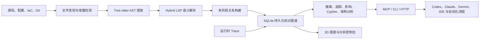

# Codebase Memory MCP 项目汇报

> 面向 AI 编码 Agent 的本地代码知识图谱基础设施

## 1. 项目定位

Codebase Memory MCP 将代码库从“文件集合”转换为可持久化、可查询、可追踪、可审计的结构化知识图谱，并通过 MCP（Model Context Protocol）向 Codex、Claude Code、Gemini、VS Code 等 AI 编码客户端提供代码理解能力。

它不是新的大语言模型，也不是普通的全文搜索工具，而是位于 AI Agent 与代码库之间的“结构化代码记忆层”。

### 一句话价值主张

> 将 AI 对代码库的一次性、逐文件探索，升级为可复用的结构化理解，从而提高准确性、降低 Token 成本，并控制代码变更风险。

## 2. 项目背景与核心痛点

传统 AI 编码 Agent 理解陌生项目时，通常依赖目录遍历、关键词搜索和逐文件读取，存在以下问题：

1. **上下文成本高**：大量文件内容被重复送入模型，占用 Token 和时间。
2. **关系理解弱**：文本搜索可以找到名字，但难以回答“谁调用它”“修改后影响谁”。
3. **跨文件语义不足**：导入、继承、泛型、路径别名和动态框架关系难以通过纯文本还原。
4. **结果不可复用**：每次新会话或新 Agent 都需要重新探索同一代码库。
5. **大型项目扩展性差**：单体仓库、多语言仓库和微服务体系中的关系数量远超人工阅读能力。
6. **缺少可信边界**：搜索结果为空时，Agent 很难判断是真的不存在，还是文件未被扫描、语法未被解析。

本项目通过“预计算知识图谱 + 结构化查询 + 覆盖度校验”解决这些问题。

## 3. 理论依据

### 3.1 编译原理与 AST

项目基于 Tree-sitter 将源码解析为抽象语法树（AST），从语法结构中提取函数、类、接口、变量、模块、路由和调用点。

与正则或关键词匹配相比，AST 能够区分同名文本在注释、字符串和真实代码结构中的不同含义，是构建可靠代码关系的基础。

当前源码包含约 159 个 Tree-sitter grammar 包装器，覆盖主流编程语言以及配置、模板、基础设施和领域语言。

### 3.2 静态程序分析

项目应用了以下经典静态分析思想：

- 符号表与限定名，用于区分跨文件、跨模块的同名符号。
- 调用图，用于分析函数之间的调用关系。
- 导入图与类型传播，用于解析跨文件引用。
- 控制流与复杂度指标，用于识别高风险、高复杂度代码。
- 数据流分析，用于追踪参数和值在调用链中的传播。
- 变更影响传播，用于估算 Git diff 的直接和间接影响范围。

### 3.3 Hybrid LSP 语义解析

Tree-sitter 主要提供语法结构，无法独立判断 `user.profile.display_name()` 最终对应哪个类型和方法。

项目在 AST 之上实现轻量级 Hybrid LSP 层，对导入、泛型、继承、方法分派、返回类型和标准库类型进行推导，从而提高 `CALLS`、`USAGE` 和类型关系的准确性。

这种“语法提取 + 语义修正”的双层架构兼顾了解析速度和关系质量。

### 3.4 图论与复杂网络分析

代码被建模为属性图：

- 节点表示项目、文件、模块、类、函数、接口、路由和基础设施资源。
- 边表示定义、调用、导入、继承、实现、使用、配置、数据流和跨服务通信。

在此基础上，可以使用 BFS 路径遍历、中心性、社区发现、依赖传播等方法分析：

- 调用链与依赖链。
- 核心入口与架构热点。
- 实际模块边界。
- 变更爆炸半径。
- 跨仓库、跨服务关系。

### 3.5 信息检索与上下文工程

项目结合 BM25、camelCase/snake_case 分词、语义向量、MinHash/LSH 和图结构信号，解决“用户描述与代码命名不一致”的检索问题。

其本质是先将代码压缩成高信息密度的结构，再把与问题相关的最小证据集交给大模型，从而减少无效上下文。

### 3.6 MCP 的关注点分离

项目本身不包含 LLM。MCP 客户端负责把自然语言问题转换为工具调用，Codebase Memory MCP 负责确定性地执行图查询并返回证据。

这种分层降低了模型绑定、API Key、推理费用和二次部署成本，也让同一个代码知识层可以被多个 Agent 复用。

## 4. 总体架构

主要代码模块包括：

| 模块 | 作用 |
|---|---|
| `internal/cbm/` | Tree-sitter grammar 与 AST 提取引擎 |
| `src/pipeline/` | 多阶段索引、语义解析、路径别名和关系构建 |
| `src/store/` | SQLite 图存储、遍历、搜索和聚类 |
| `src/mcp/` | MCP JSON-RPC 服务和工具实现 |
| `src/cypher/` | 只读 openCypher 子集的解析与执行 |
| `src/watcher/` | 后台变更检测与增量同步 |
| `src/traces/` | 运行时调用数据回灌 |
| `src/ui/`、`graph-ui/` | 内置 HTTP 服务与 3D 图谱界面 |
| `src/cli/` | 安装、更新、配置及多 Agent 集成 |

## 5. 核心价值

### 5.1 提升 AI 代码理解质量

传统搜索回答“哪里出现了这个词”，知识图谱可以回答：

- 符号在哪里定义？
- 哪些入口会到达它？
- 它依赖哪些函数和配置？
- 修改它会影响哪些文件、测试和服务？
- 是否存在同类实现或近似重复代码？

这使 AI 从“文本阅读者”升级为“结构化代码分析者”。

### 5.2 降低 Token 与工具调用成本

索引阶段一次性提取结构，查询阶段只返回相关符号、路径和关系，不需要反复读取整文件。

项目论文和 README 给出的数据包括：

- 31 个真实仓库评测中，答案质量约 83%。
- 相比逐文件探索，Token 使用量减少约 10 倍。
- 工具调用次数减少约 2.1 倍。
- 特定 5 项结构化查询实验中，约 3,400 Token 对比约 412,000 Token，减少 99.2%。

以上属于项目论文或文档基准，正式对外汇报前应在当前分支和目标硬件上复测。

### 5.3 控制代码变更风险

通过入向调用、间接依赖、入口、测试和跨服务关系，系统可以为改动建立影响面：

- 代码评审前识别高风险修改。
- 自动生成建议回归测试范围。
- 判断公共函数、核心存储层或平台适配层的爆炸半径。
- 发现修改是否穿透前端、后端、网关或消息链路。

### 5.4 加速项目上手与知识传承

新成员可以快速获得语言分布、模块边界、入口、路由、热点和核心调用链，而不必依赖口口相传。

图谱、ADR 和共享索引文件还可以跨会话、跨成员持久化，降低人员流动带来的知识损失。

### 5.5 支撑大型、多语言和微服务项目

项目不仅分析单仓库代码，还可通过 `CROSS_*` 边连接多个仓库中的 HTTP、异步 Channel、gRPC、GraphQL 和 tRPC 关系。

这使其具备构建组织级技术地图的潜力，适合大型单体仓库、前后端分离、微服务和事件驱动架构。

### 5.6 本地隐私与企业部署价值

源码、图谱和查询均保留在本地，不要求外部模型、Ollama、Docker 或第三方 API Key。

远程 MCP 模式支持鉴权、审计日志和限制工具配置，可进一步用于团队内部服务化部署。

### 5.7 可信分析与可审计性

项目不仅返回答案，还暴露：

- 索引时间与模式。
- 未索引目录和文件。
- 解析失败或部分解析区间。
- 查询是否分页截断。
- 文件元数据是否已变化。
- 建议回退到源码核验的路径。

这种“证据 + 覆盖度 + 局限说明”的设计，能够减少 Agent 把“不知道”误判为“不存在”。

## 6. 功能特性

### 6.1 索引与更新

- 全量、适中、快速三种索引模式。
- RAM-first 并行索引，完成后释放内存。
- SQLite 持久化与增量更新。
- 后台 watcher 自动检测 Git 和文件变化。
- `.gitignore`、`.cbmignore`、软链接和大文件策略。
- 团队共享 `.codebase-memory/graph.db.zst` 压缩图谱。
- 索引覆盖度和持久化完整性校验。

### 6.2 搜索与源码定位

- 按名称、标签、路径和度数进行结构化搜索。
- BM25 全文检索，支持驼峰和下划线分词。
- 语义向量检索，解决自然语言与代码命名的词汇差异。
- 图增强文本搜索，将文本命中归并到所属函数并按结构重要性排序。
- 通过 qualified name 精确读取函数或类源码。

### 6.3 关系与影响分析

- 入向、出向和双向调用链。
- 参数级数据流追踪。
- Git diff 影响面和风险等级。
- 直接及间接依赖、受影响文件、入口和测试分析。
- 跨服务调用链与跨仓库关系。
- 运行时 trace 回灌和静态关系校验。

### 6.4 架构与质量分析

- 语言、包、入口、路由和边界概览。
- 实际模块聚类和社区发现。
- 圈复杂度、认知复杂度和循环深度。
- 循环内线性扫描、分配、递归等热点信号。
- 死代码候选和高扇入核心节点。
- 近似重复代码与语义相关代码。
- ADR 的存储和读取。

### 6.5 跨服务与基础设施分析

- REST 路由与客户端调用匹配。
- gRPC、GraphQL、tRPC 和消息 Channel 检测。
- Dockerfile、Kubernetes 和 Kustomize 资源建模。
- 配置项、环境变量和代码使用点连接。

### 6.6 交付与运行

- MCP stdio、CLI 和远程 Streamable HTTP。
- Windows、Linux、macOS 及 x64/ARM64 发布矩阵。
- 单一静态二进制，零运行时依赖。
- 内置 3D 图谱和桌面端控制台。
- 诊断日志、内存轨迹、smoke、soak、sanitizer 和安全流水线。
- 面向多种 AI 客户端的安装、规则、Skill、Hook 和 Agent Profile。

## 7. 当前分支的差异化价值

本仓库由 `ycsx/codebase-memory-mcp` 维护，基于 `DeusData/codebase-memory-mcp` 上游项目。对外汇报时，应区分“上游项目通用能力”和“当前分支新增或强化能力”。

当前分支最明确的专项价值是 Vue 2 与 Webpack 静态分析支持。

### 7.1 Vue 单文件组件深度解析

对于 `.vue` 文件，系统不仅识别组件文件，还会提取 `<script>` 或 `<script setup>` 中的内容并进行二次 JavaScript/TypeScript 解析，继续生成：

- 定义关系。
- 导入关系。
- 函数调用。
- 消息 Channel。
- 正确映射回原始 Vue 文件的源码行号。

### 7.2 Vue CLI 与 Webpack 路径别名

系统可静态读取以下配置来源：

- `tsconfig.json`、`jsconfig.json` 的 `paths` 和 `baseUrl`。
- Vue CLI 默认 `@ -> src` 别名。
- `vue.config.js`、`vue.config.cjs`。
- `webpack.config.js`、`webpack.config.cjs` 中的静态 alias。

配置代码不会被执行，从而兼顾分析能力和安全性。

### 7.3 遗留前端治理场景

这些能力可以进一步服务于：

- Vue 2 组件依赖盘点。
- 公共组件修改影响分析。
- 路径别名还原和失效引用检测。
- Webpack 到 Vite 的迁移准备。
- Vue 2 到 Vue 3 的迁移批次规划。
- 前端组件到后端 API 的跨层关系追踪。

## 8. 当前项目实证数据

### 8.1 本仓库知识图谱统计

当前对本仓库的索引结果为：

| 指标 | 数量 |
|---|---:|
| 索引文件 | 586 |
| 图节点 | 14,674 |
| 图关系 | 84,329 |
| 函数节点 | 12,264 |
| `CALLS` 关系 | 40,059 |
| `SIMILAR_TO` 关系 | 13,281 |
| `USAGE` 关系 | 10,378 |
| `IMPORTS` 关系 | 1,186 |

这些数据说明项目已经能够使用自身能力分析自身代码库，具备一定的自举验证价值。

### 8.2 项目文档性能数据

README 中记录的 Apple M3 Pro 基准包括：

| 操作 | 文档结果 |
|---|---:|
| Linux Kernel 完整索引，约 2,800 万行、7.5 万文件 | 约 3 分钟 |
| Django 完整索引 | 约 6 秒 |
| Cypher 关系查询 | 小于 1ms |
| 名称搜索 | 小于 10ms |
| 深度 5 调用链 | 小于 10ms |
| 全图死代码扫描 | 约 150ms |

这些数字属于项目文档基准，不代表当前 Windows 环境或当前分支的独立复测结果。

### 8.3 语言质量基准

`docs/BENCHMARK.md` 的较早版本汇总结果包括：

- 35 种语言进入最终汇总。
- 共执行 370 个有效问题。
- 327 个 PASS，25 个 PARTIAL，18 个 FAIL。
- 综合得分 339.5/370，即 91.8%。
- 17 种语言达到 100%。
- 最弱语言仍达到 62%。

该基准也明确披露了函数属性、Haskell 组合调用、OCaml functor、部分动态模式和查询能力等限制。

### 8.4 测试与工程资产

当前源码中可统计到：

- 约 6,821 处 `TEST(...)` 定义，其中包含非门禁的缺陷复现测试。
- 114 个根级测试文件。
- 58 个前端测试文件。
- 21 个 GitHub Actions workflow。
- 覆盖 lint、跨平台测试、smoke、soak、TSan、ASan、CodeQL、SBOM、签名和 VirusTotal 的发布设计。

README 徽章中的“5,604 passing”属于项目声明。本次本地全量 test runner 未得到可解释输出，因此不应将该数字表述为本次独立验证结果。

## 9. 典型应用场景

### 9.1 新成员项目上手

快速回答项目由哪些模块组成、入口在哪里、核心链路是什么、哪些模块耦合度最高。

### 9.2 代码修改与评审

在修改核心函数、公共组件或存储层前，自动生成调用方、受影响文件、入口、测试和跨服务影响。

### 9.3 故障排查

从接口路由出发，追踪到控制器、业务函数、存储层、配置、下游服务和事件 Channel。

### 9.4 技术债治理

发现高复杂度函数、近似重复实现、死代码候选、高扇入节点和架构边界异常。

### 9.5 遗留系统现代化

分析 Vue 2、Webpack、路径别名和跨组件关系，为框架升级、构建工具迁移和模块拆分提供依据。

### 9.6 AI 编码 Agent 增强

为代码生成、重构、测试生成和缺陷修复提供结构化上下文，减少无效搜索和错误假设。

## 10. 与常见方案的差异

| 方案 | 优点 | 局限 | 本项目的补充价值 |
|---|---|---|---|
| `grep` / `ripgrep` | 快速、简单、精确文本匹配 | 不理解调用、类型和影响关系 | 将文本结果提升为符号和关系查询 |
| IDE Language Server | 单语言语义准确 | 多语言部署复杂，通常不提供持久化跨仓图谱 | 统一多语言图模型和 MCP 接口 |
| 向量数据库 RAG | 擅长语义召回 | 关系推理和精确调用链较弱 | 语义搜索与确定性图关系结合 |
| 内置 LLM 的代码平台 | 自然语言体验完整 | 需要额外模型、API Key、费用和数据边界 | 复用现有 Agent，保持本地、模型无关 |
| 人工架构文档 | 表达清晰 | 容易过期，维护成本高 | 从当前代码持续生成并用 ADR 补充意图 |

## 11. 延伸方向

### P0：完成产品化与数据校准

- 发布正式 Release 和可安装二进制。
- 统一 `158/159` 种语言、测试数量、算法名称等文档口径。
- 在当前分支、目标硬件和典型业务仓库上重新执行性能与质量基准。
- 建立版本、代码、文档、包管理清单的一致性检查。

### P1：建设 PR/CI 风险门禁

- 自动分析每个 PR 的直接和间接影响。
- 输出缺失测试、公共 API 影响、复杂度增长和架构违规。
- 依据风险等级推荐评审人和回归范围。
- 生成可归档的变更影响报告。

### P1：形成 Vue 2/Webpack 专项产品

- 组件依赖和公共组件影响分析。
- 动态加载、异步组件和路由关系增强。
- Webpack loader/plugin/alias 兼容性扫描。
- Vue 2 到 Vue 3、Webpack 到 Vite 的迁移评估与任务拆分。

### P2：静态分析与运行时闭环

- 接入 OpenTelemetry、测试覆盖率和生产调用数据。
- 用运行时事实校准静态 `CALLS`、`HTTP_CALLS` 和 Channel 关系。
- 识别“静态可达但运行时从未执行”与“运行时存在但静态未解析”的路径。

### P2：时序与组织级知识图谱

- 保存关键版本的图谱快照。
- 分析架构漂移、耦合增长、热点演化和历史共变文件。
- 连接代码仓库、服务目录、Owner、事故、需求和 ADR。
- 建设企业级技术资产地图和代码知识门户。

### P2：扩大语义解析覆盖面

- 将 Hybrid LSP 扩展到更多语言。
- 加强反射、依赖注入、动态注册和事件总线解析。
- 完善框架级插件模型，允许团队添加领域规则。

## 12. 风险与当前边界

1. **发布状态**：当前 fork 尚未发布正式 GitHub Release，README 仍以源码安装为主。
2. **版本状态**：包清单标记为 `0.8.1`，本地构建二进制显示为 `dev`，且当前仓库没有版本 Tag。
3. **文档口径**：语言数量、测试数量和社区发现算法名称存在少量不一致，需要统一。
4. **静态分析边界**：反射、动态注册、运行时生成代码和部分事件总线关系无法保证完整发现。
5. **覆盖度边界**：没有记录解析缺口不等于图谱绝对完整，关键结论仍应回读源码。
6. **基准可迁移性**：上游、旧版本或 Apple M3 Pro 的数据不能直接等价为当前 Windows 分支表现。
7. **能力归属**：应明确区分上游项目能力和当前 fork 的新增贡献，避免汇报口径失真。

## 13. 建议演示流程

可以选择一个 Vue 2 业务项目，通过以下流程展示完整价值链：

1. 使用 `index_repository` 建立项目知识图谱。
2. 使用 `get_architecture` 展示语言、模块、入口、路由和热点。
3. 使用 `search_graph` 定位一个公共 Vue 组件或业务函数。
4. 使用 `trace_path` 展示上下游调用链。
5. 使用 `explain_impact` 展示修改后的影响文件、入口和测试。
6. 使用 `get_code_snippet` 回读关键源码作为最终证据。
7. 使用 `check_index_coverage` 展示可信度与覆盖边界。
8. 在 3D UI 中展示跨模块或跨仓库关系。

这个演示可以同时体现速度、关系理解、风险控制、源码证据和可信边界。

## 14. 建议汇报结构

建议将正式汇报控制在 8 页左右：

1. **项目定位**：AI 编码 Agent 的结构化代码记忆层。
2. **问题背景**：逐文件探索成本高、关系理解弱、结果无法复用。
3. **技术原理**：Tree-sitter + Hybrid LSP + 知识图谱 + MCP。
4. **核心能力**：搜索、追踪、影响、架构、跨服务和可信覆盖。
5. **量化价值**：Token、工具调用、索引性能和本仓图谱数据。
6. **分支特色**：Vue 2 SFC 与 Webpack/Vue CLI alias 分析。
7. **应用场景**：上手、评审、排障、治理、迁移和 Agent 增强。
8. **路线图与边界**：产品化、PR 门禁、动态闭环、企业图谱与当前风险。

## 15. 结论

Codebase Memory MCP 的核心价值不只是“更快地搜索代码”，而是将代码库转化为 AI 可以持续使用的结构化知识资产。

它把编译原理、静态分析、信息检索和知识图谱整合进本地、低依赖、标准化的 MCP 服务中，在提升 AI 编码效率的同时，也为架构理解、变更治理、知识传承和遗留系统现代化提供了可扩展基础。

对于当前 fork，Vue 2 与 Webpack 支持是最适合形成差异化汇报和业务落地的切入点；而正式 Release、统一指标和在真实业务仓库上的复测，则是从“技术能力完整”走向“产品价值可证明”的关键下一步。

## 参考资料

- [项目 README](../README.md)
- [语言基准报告](BENCHMARK.md)
- [评测计划](EVALUATION_PLAN.md)
- [远程 MCP 部署说明](REMOTE_MCP.md)
- [项目论文：Codebase-Memory: Tree-Sitter-Based Knowledge Graphs for LLM Code Exploration via MCP](https://arxiv.org/abs/2603.27277)
- 索引主流程：`src/pipeline/pipeline.c`
- Vue 嵌入脚本解析：`internal/cbm/extract_imports.c`
- Vue/Webpack 路径别名：`src/pipeline/path_alias.c`
- 跨仓库路由匹配：`src/pipeline/pass_cross_repo.c`
- MCP 搜索与工具实现：`src/mcp/mcp.c`
